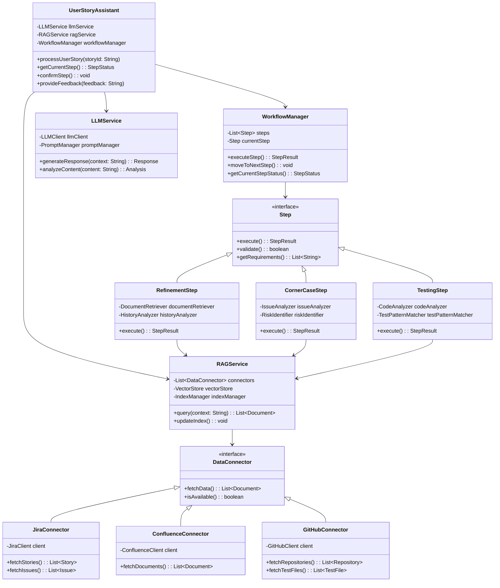
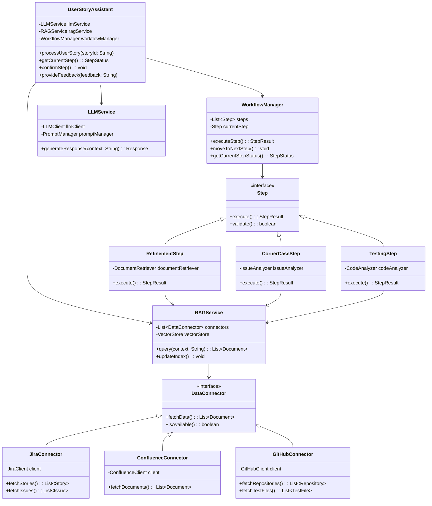
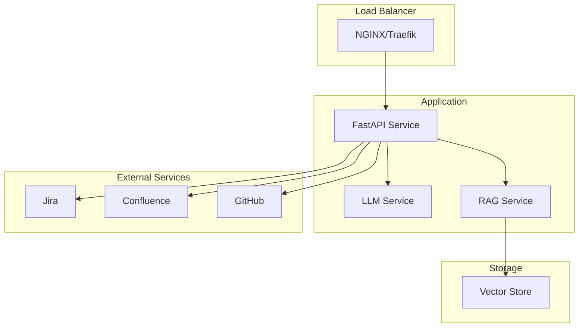
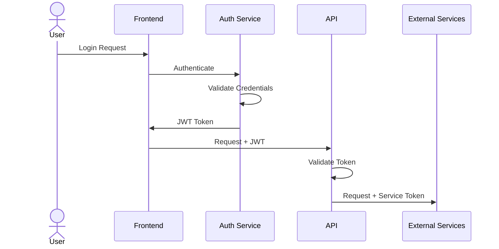
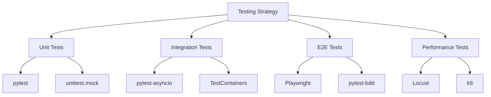
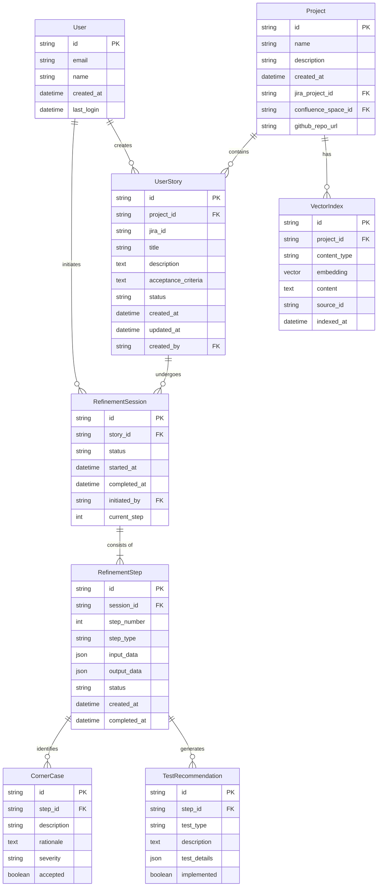
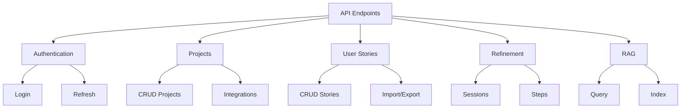

> Detalla en esta sección los prompts principales utilizados durante la creación del proyecto, que justifiquen el uso de asistentes de código en todas las fases del ciclo de vida del desarrollo. Esperamos un máximo de 3 por sección, principalmente los de creación inicial o  los de corrección o adición de funcionalidades que consideres más relevantes.
Puedes añadir adicionalmente la conversación completa como link o archivo adjunto si así lo consideras


## Índice

1. [Descripción general del producto](#1-descripción-general-del-producto)
2. [Arquitectura del sistema](#2-arquitectura-del-sistema)
3. [Modelo de datos](#3-modelo-de-datos)
4. [Especificación de la API](#4-especificación-de-la-api)
5. [Historias de usuario](#5-historias-de-usuario)
6. [Tickets de trabajo](#6-tickets-de-trabajo)
7. [Pull requests](#7-pull-requests)

---

## 1. Descripción general del producto

# Prompts

Usé Claude 3.5 para generar los prompts. Esta es la conversación: https://claude.ai/chat/04f3eff2-21a4-46ca-89e3-45d66b0244a4

**Prompt 1:**

Queremos crear un asistente que usará un LLM y un sistema RAG para ayudar con el proceso de refinamiento de historias de usuario de un equipo de desarrollo.

Por el momento centrémonos en crear el documento PRD.

Para el mvp la conexión para extraer los datos se hará con Jira y Confluence. 
También se podrá configurar una conexión con github para acceder al código fuente del proyecto. Que podrá estar en uno o en varios repositorios.

En el futuro se podrá conectar con otros sitemas, pero por el momento no es el foco para el mvp.

Será un proceso de varios pasos en los que el usuario tendrá que confirmar que está deacuerdo con el con el resultado del paso para pasar al siguiente. Dichos pasos serán:

Paso 1: El usuario le pasará el identificador de una historia de usuario o directamente el texto y el asistentente le ayudará a mejorar la definición de dicha historia y de los criterios de aceptación. Para ello el asistente podrá revisar historias de usuario pasadas del proyecto, si las hubiera, adaptandose al estilo en el que están hechas dichas historias. También debería tener en cuenta cualquier documentación en confluence que esté relacionada. No se limitará solo a copiar el estilo, sino que tratará de mejorarlo. El usuario irá hablando con el asistente, pidiéndole los cambios que estime oportunos, hasta estár deacuerdo con la respuesta y avanzar al siguiente paso.
Paso 2: Con la salida del Paso 1 el asistente tratará de indentificar posibles casos esquina (corner cases). Para ello se valdrá también de información pasada, teniendo en cuenta cosas como por ejemplo incidencias para identificar posibles riesgos en base a los problemas que se tuvieron anteriormente. Dichos casos esquina deberían traducirse en nuevos criterios de aceptación, dando así una versión mejorada de la historia de usuario. Una vez el usuario esté deacuerdo con la nueva versión de la historia de usuario podrá proceder al paso 3.
Paso 3: Con la salida del Paso 2, que consistirá en una versión de la historia de usuario que debería estar bien definida y con los suficientes criterios de aceptación como para cubrir los casos esquina, el asistente tratará de identificar los tipos de tests y los tests que serán necesarios para dar cobertura a los criterios de aceptación de la historia de usuario. Para ello, podrá consultar con Jira y con github para ver cómo y de qué tipo se están haciendo los tests en historias pasadas. Pero el objetivo no es solo imitar, sino mejorar, por tanto, si no se está haciendo previamente un tipo de tests que sea relevante para la historia de usuario podrá dar recomendaciones para empezar a hacer dicho nuevo tipo de tests. Debería cubrir todas las capas de tests, incluyendo recomendaciones para cómo proceder con los tests unitarios, integración, end to end (ya sea de front o de back), performance y cualquier otro tipo de testing que pueda ser relevante.
Como indiqué anteriormente, en primer lugar procedamos a crear el documento PRD para el sistema descrito.

**Answer 1:**

Entiendo que necesitas crear un PRD (Product Requirements Document) para un asistente inteligente que ayude en el refinamiento de historias de usuario. Crearé un documento detallado que capture todos los aspectos importantes del sistema.

# PRD: Asistente IA para Refinamiento de Historias de Usuario

## 1. Descripción del Producto

### 1.1 Visión General
El Asistente de Refinamiento de Historias de Usuario es una herramienta basada en IA que ayuda a los equipos de desarrollo a mejorar la calidad de sus historias de usuario a través de un proceso guiado de tres pasos. Utiliza tecnología LLM (Large Language Model) combinada con un sistema RAG (Retrieval-Augmented Generation) para proporcionar recomendaciones contextualizadas basadas en el histórico del proyecto.

### 1.2 Objetivo del Producto
Mejorar la calidad y completitud de las historias de usuario mediante:
- Refinamiento de definiciones y criterios de aceptación
- Identificación proactiva de casos esquina
- Recomendaciones comprensivas de estrategias de testing

## 2. Alcance del MVP

### 2.1 Integraciones Iniciales
- Jira: Para acceso a historias de usuario e incidencias
- Confluence: Para acceso a documentación relacionada
- GitHub: Para acceso al código fuente y tests existentes
  - Soporte para múltiples repositorios de un mismo proyecto

### 2.2 Fuera del Alcance del MVP
- Integraciones con otros sistemas de gestión de proyectos
- Automatización de la creación o modificación de tests
- Integración con otros sistemas de control de versiones

## 3. Funcionalidades Principales

### 3.1 Proceso de Refinamiento
El sistema implementa un flujo de trabajo en tres pasos secuenciales, cada uno requiriendo confirmación del usuario para avanzar.

#### Paso 1: Mejora de Definición
**Entrada:**
- ID de historia de usuario o texto directo
- Acceso a historias previas y documentación relacionada

**Funcionalidades:**
- Análisis del estilo existente de historias de usuario
- Sugerencias de mejora manteniendo consistencia con el proyecto
- Interfaz conversacional para iteraciones de refinamiento
- Acceso a documentación relacionada en Confluence

**Salida:**
- Historia de usuario mejorada con criterios de aceptación refinados

#### Paso 2: Identificación de Casos Esquina
**Entrada:**
- Historia refinada del Paso 1
- Histórico de incidencias y problemas previos

**Funcionalidades:**
- Análisis de incidencias históricas relacionadas
- Identificación de riesgos potenciales
- Generación de criterios de aceptación adicionales
- Documentación de casos esquina identificados

**Salida:**
- Historia de usuario actualizada con criterios adicionales
- Documentación de casos esquina identificados

#### Paso 3: Estrategia de Testing
**Entrada:**
- Historia refinada del Paso 2
- Acceso a código fuente y tests existentes

**Funcionalidades:**
- Análisis de prácticas actuales de testing
- Recomendaciones de tipos de tests necesarios:
  - Tests unitarios
  - Tests de integración
  - Tests end-to-end
  - Tests de rendimiento
  - Otros tipos según necesidad
- Sugerencias de mejora sobre prácticas actuales

**Salida:**
- Plan detallado de estrategia de testing
- Recomendaciones específicas para cada tipo de test

## 4. Requisitos Técnicos

### 4.1 Integración con Sistemas Externos
- API de Jira para lectura de historias e incidencias
- API de Confluence para acceso a documentación
- API de GitHub para acceso a repositorios
- Capacidad de autenticación con todos los sistemas

### 4.2 Sistema RAG
- Indexación de:
  - Historias de usuario previas
  - Documentación de Confluence
  - Código fuente y tests
  - Incidencias históricas
- Actualización periódica del índice
- Capacidad de búsqueda contextual

### 4.3 Modelo LLM
- Capacidad de procesamiento de lenguaje natural
- Comprensión de contexto técnico
- Generación de recomendaciones estructuradas
- Manejo de diálogo interactivo

## 5. Requisitos No Funcionales

### 5.1 Rendimiento
- Tiempo de respuesta máximo de 5 segundos para consultas simples
- Tiempo de respuesta máximo de 15 segundos para análisis complejos
- Capacidad de procesar múltiples solicitudes simultáneas

### 5.2 Seguridad
- Autenticación segura con sistemas externos
- Manejo seguro de tokens y credenciales
- Logging de todas las operaciones
- Cumplimiento con políticas de seguridad corporativas

### 5.3 Usabilidad
- Interfaz conversacional intuitiva
- Feedback claro en cada paso del proceso
- Capacidad de deshacer/revertir recomendaciones
- Documentación clara del proceso

### 5.4 Mantenibilidad
- Arquitectura modular para futuras integraciones
- Documentación técnica completa
- Logs detallados para debugging
- Tests automatizados del sistema

## 6. Métricas de Éxito

### 6.1 Métricas Cuantitativas
- Reducción en el tiempo de refinamiento de historias
- Reducción en el número de incidencias post-implementación
- Incremento en la cobertura de tests
- Tasa de adopción por el equipo

### 6.2 Métricas Cualitativas
- Satisfacción del equipo con las recomendaciones
- Calidad percibida de las historias refinadas
- Utilidad de las recomendaciones de testing
- Facilidad de uso del sistema

## 7. Futuras Consideraciones

### 7.1 Posibles Expansiones
- Integración con otros sistemas de gestión de proyectos
- Soporte para otros sistemas de control de versiones
- Automatización de la creación de tests
- Análisis predictivo de riesgos
- Integración con sistemas de CI/CD

### 7.2 Limitaciones Conocidas del MVP
- Limitado a integraciones específicas
- Sin automatización de implementación
- Dependencia de calidad de datos históricos


He creado un PRD detallado que cubre todos los aspectos del sistema propuesto. ¿Hay algún aspecto específico que te gustaría que expandiera o modificara? Por ejemplo, podríamos:

1. Profundizar en los detalles técnicos del sistema RAG
2. Especificar más los requisitos de seguridad
3. Detallar más las métricas de éxito
4. Agregar más casos de uso específicos

---

## 2. Arquitectura del Sistema

### **2.1. Diagrama de arquitectura:**

**Prompt 1:**

He revisado el PRD y me parece correcto. A continuación me gustaría empezar a definir la arquitectura del sistema. Para ello dame un diagrama UML así como un texto explicativo del sistema.

**Answer 1:**

Por supuesto. Diseñaré una arquitectura que refleje los requisitos establecidos en el PRD, con un enfoque en la modularidad y extensibilidad.





# Arquitectura del Sistema de Asistente de Refinamiento de Historias de Usuario

## 1. Componentes Principales

### 1.1 UserStoryAssistant
Es el punto de entrada principal del sistema y actúa como fachada para toda la funcionalidad. Coordina la interacción entre los diferentes componentes y maneja el estado global del proceso de refinamiento.

Responsabilidades:
- Gestionar el flujo de trabajo completo
- Coordinar la comunicación entre servicios
- Mantener el estado de la sesión
- Procesar la entrada del usuario

### 1.2 WorkflowManager
Gestiona el flujo de trabajo de tres pasos y el estado de cada paso del proceso.

Responsabilidades:
- Controlar la secuencia de pasos
- Validar las transiciones entre pasos
- Mantener el estado del workflow
- Gestionar las confirmaciones del usuario

### 1.3 LLMService
Encapsula la interacción con el modelo de lenguaje y gestiona la generación de respuestas.

Responsabilidades:
- Comunicación con el LLM
- Gestión de prompts
- Procesamiento de respuestas
- Manejo de contexto conversacional

### 1.4 RAGService
Gestiona el sistema de recuperación y generación aumentada de información.

Responsabilidades:
- Indexación de documentos
- Búsqueda contextual
- Gestión de la base de conocimiento
- Coordinación de conectores de datos

## 2. Implementación de Pasos

### 2.1 RefinementStep
Implementa el primer paso del proceso, centrándose en la mejora de la definición de la historia.

Funcionalidades:
- Análisis de historias existentes
- Extracción de patrones de escritura
- Generación de sugerencias de mejora
- Validación de criterios de aceptación

### 2.2 CornerCaseStep
Implementa el segundo paso, enfocado en la identificación de casos esquina.

Funcionalidades:
- Análisis de incidencias pasadas
- Identificación de patrones de riesgo
- Generación de casos de prueba
- Validación de cobertura

### 2.3 TestingStep
Implementa el tercer paso, centrado en la estrategia de testing.

Funcionalidades:
- Análisis de código existente
- Identificación de patrones de test
- Recomendaciones de estrategias
- Validación de cobertura de testing

## 3. Conectores de Datos

### 3.1 JiraConnector
Gestiona la conexión con Jira y la recuperación de información relacionada.

Funcionalidades:
- Recuperación de historias de usuario
- Acceso a incidencias
- Gestión de metadatos
- Caché de datos frecuentes

### 3.2 ConfluenceConnector
Maneja la conexión con Confluence y el acceso a documentación.

Funcionalidades:
- Recuperación de documentos
- Indexación de contenido
- Gestión de versiones
- Caché de documentos

### 3.3 GitHubConnector
Gestiona el acceso a repositorios de GitHub y análisis de código.

Funcionalidades:
- Acceso a repositorios
- Análisis de código fuente
- Recuperación de tests
- Gestión de versiones

## 4. Aspectos Técnicos

### 4.1 Gestión de Estado
- Uso de patrón State para el workflow
- Persistencia temporal de sesiones
- Manejo de transacciones largas
- Recuperación ante fallos

### 4.2 Caché y Rendimiento
- Caché de consultas frecuentes
- Indexación incremental
- Procesamiento asíncrono
- Optimización de consultas

### 4.3 Seguridad
- Autenticación delegada
- Gestión segura de tokens
- Auditoría de operaciones
- Cifrado de datos sensibles

## 5. Consideraciones de Implementación

### 5.1 Extensibilidad
- Uso de interfaces para componentes clave
- Diseño modular para nuevos conectores
- Abstracción de servicios externos
- Configuración flexible

### 5.2 Mantenibilidad
- Logging comprensivo
- Métricas de rendimiento
- Tests automatizados
- Documentación inline

### 5.3 Escalabilidad
- Diseño stateless donde sea posible
- Procesamiento asíncrono
- Caché distribuido
- Balanceo de carga


He diseñado una arquitectura que:
1. Implementa el flujo de tres pasos definido en el PRD
2. Mantiene alta cohesión y bajo acoplamiento
3. Permite extensibilidad para futuras integraciones
4. Incorpora patrones de diseño relevantes

¿Te gustaría que profundizara en algún aspecto específico de la arquitectura? Por ejemplo:
1. Detalles de la implementación del RAG
2. Estrategias de caché y optimización
3. Manejo de sesiones y estado
4. Patrones de diseño específicos

**Prompt 2:**

Por el momento, como estamos hablando del mvp, elimina cosas no necesarias para una primera versión, como pudiera ser el caché distribuido y el balanceo de carga. Eso entraría dentro de las futuras consideraciones en el documento prd.

**Answer 2:**

Tienes razón. Voy a simplificar la arquitectura para centrarnos en lo esencial para el MVP.





# Arquitectura del Sistema de Asistente de Refinamiento de Historias de Usuario - MVP

## 1. Componentes Principales

### 1.1 UserStoryAssistant
Punto de entrada principal del sistema que coordina el flujo de trabajo básico.

Responsabilidades:
- Gestionar el flujo de trabajo
- Coordinar la comunicación entre servicios
- Mantener el estado básico de la sesión

### 1.2 WorkflowManager
Gestiona el flujo de trabajo de tres pasos.

Responsabilidades:
- Controlar la secuencia de pasos
- Validar las transiciones entre pasos
- Mantener el estado del workflow

### 1.3 LLMService
Gestiona la interacción con el modelo de lenguaje.

Responsabilidades:
- Comunicación con el LLM
- Gestión de prompts básicos
- Procesamiento de respuestas

### 1.4 RAGService
Gestiona el sistema de recuperación y generación de información.

Responsabilidades:
- Indexación básica de documentos
- Búsqueda contextual
- Gestión de conectores de datos

## 2. Implementación de Pasos

### 2.1 RefinementStep
Primer paso del proceso para la mejora de la definición de la historia.

Funcionalidades:
- Análisis de historias existentes
- Generación de sugerencias de mejora
- Validación básica de criterios de aceptación

### 2.2 CornerCaseStep
Segundo paso para la identificación de casos esquina.

Funcionalidades:
- Análisis de incidencias pasadas
- Identificación de riesgos básicos
- Generación de casos de prueba

### 2.3 TestingStep
Tercer paso para la estrategia de testing.

Funcionalidades:
- Análisis básico de código existente
- Recomendaciones de estrategias de testing
- Validación de cobertura básica

## 3. Conectores de Datos

### 3.1 JiraConnector
Conexión básica con Jira.

Funcionalidades:
- Recuperación de historias de usuario
- Acceso a incidencias

### 3.2 ConfluenceConnector
Conexión básica con Confluence.

Funcionalidades:
- Recuperación de documentos
- Indexación de contenido

### 3.3 GitHubConnector
Acceso básico a repositorios de GitHub.

Funcionalidades:
- Acceso a repositorios
- Recuperación de tests

## 4. Aspectos Técnicos

### 4.1 Gestión de Estado
- Estado en memoria para la sesión actual
- Manejo básico de errores
- Persistencia simple de datos necesarios

### 4.2 Rendimiento
- Indexación básica de documentos
- Optimización básica de consultas
- Timeout y reintentos simples

### 4.3 Seguridad
- Autenticación básica con servicios externos
- Gestión de tokens de acceso
- Logging básico de operaciones

## 5. Consideraciones de Implementación

### 5.1 Extensibilidad
- Interfaces básicas para componentes principales
- Diseño modular simple
- Configuración básica

### 5.2 Mantenibilidad
- Logging básico
- Tests unitarios esenciales
- Documentación básica del código


Los principales cambios realizados han sido:

1. Simplificación del diagrama de clases eliminando métodos y atributos no esenciales
2. Eliminación de características avanzadas como:
   - Caché distribuido
   - Balanceo de carga
   - Procesamiento asíncrono complejo
   - Sistemas avanzados de recuperación
3. Enfoque en funcionalidades básicas pero completas
4. Simplificación de la gestión de estado y persistencia

¿Te gustaría que profundizáramos en algún aspecto específico de esta versión simplificada?


### **2.2. Descripción de componentes principales:**

**Prompt 1:**

Entiendo que utilizaremos principalmente Python como lenguaje, pues es el que se suelen desarrollar este tipo de sistemas y que tiene un mayor repertorio de librerías y tecnologías relacionadas con lo que queremos hacer. Por favor, dame recomendaciones sobre las tecnologías y librerías que utilizaremos. Dame varias opciones y los pros y contras de cada una para que yo pueda elegir.

**Answer 1:**

Tienes razón. Voy a simplificar la arquitectura para centrarnos en lo esencial para el MVP.


# Arquitectura del Sistema de Asistente de Refinamiento de Historias de Usuario - MVP

## 1. Componentes Principales

### 1.1 UserStoryAssistant
Punto de entrada principal del sistema que coordina el flujo de trabajo básico.

Responsabilidades:
- Gestionar el flujo de trabajo
- Coordinar la comunicación entre servicios
- Mantener el estado básico de la sesión

### 1.2 WorkflowManager
Gestiona el flujo de trabajo de tres pasos.

Responsabilidades:
- Controlar la secuencia de pasos
- Validar las transiciones entre pasos
- Mantener el estado del workflow

### 1.3 LLMService
Gestiona la interacción con el modelo de lenguaje.

Responsabilidades:
- Comunicación con el LLM
- Gestión de prompts básicos
- Procesamiento de respuestas

### 1.4 RAGService
Gestiona el sistema de recuperación y generación de información.

Responsabilidades:
- Indexación básica de documentos
- Búsqueda contextual
- Gestión de conectores de datos

## 2. Implementación de Pasos

### 2.1 RefinementStep
Primer paso del proceso para la mejora de la definición de la historia.

Funcionalidades:
- Análisis de historias existentes
- Generación de sugerencias de mejora
- Validación básica de criterios de aceptación

### 2.2 CornerCaseStep
Segundo paso para la identificación de casos esquina.

Funcionalidades:
- Análisis de incidencias pasadas
- Identificación de riesgos básicos
- Generación de casos de prueba

### 2.3 TestingStep
Tercer paso para la estrategia de testing.

Funcionalidades:
- Análisis básico de código existente
- Recomendaciones de estrategias de testing
- Validación de cobertura básica

## 3. Conectores de Datos

### 3.1 JiraConnector
Conexión básica con Jira.

Funcionalidades:
- Recuperación de historias de usuario
- Acceso a incidencias

### 3.2 ConfluenceConnector
Conexión básica con Confluence.

Funcionalidades:
- Recuperación de documentos
- Indexación de contenido

### 3.3 GitHubConnector
Acceso básico a repositorios de GitHub.

Funcionalidades:
- Acceso a repositorios
- Recuperación de tests

## 4. Aspectos Técnicos

### 4.1 Gestión de Estado
- Estado en memoria para la sesión actual
- Manejo básico de errores
- Persistencia simple de datos necesarios

### 4.2 Rendimiento
- Indexación básica de documentos
- Optimización básica de consultas
- Timeout y reintentos simples

### 4.3 Seguridad
- Autenticación básica con servicios externos
- Gestión de tokens de acceso
- Logging básico de operaciones

## 5. Consideraciones de Implementación

### 5.1 Extensibilidad
- Interfaces básicas para componentes principales
- Diseño modular simple
- Configuración básica

### 5.2 Mantenibilidad
- Logging básico
- Tests unitarios esenciales
- Documentación básica del código


Los principales cambios realizados han sido:

1. Simplificación del diagrama de clases eliminando métodos y atributos no esenciales
2. Eliminación de características avanzadas como:
   - Caché distribuido
   - Balanceo de carga
   - Procesamiento asíncrono complejo
   - Sistemas avanzados de recuperación
3. Enfoque en funcionalidades básicas pero completas
4. Simplificación de la gestión de estado y persistencia

¿Te gustaría que profundizáramos en algún aspecto específico de esta versión simplificada?

### **2.3. Descripción de alto nivel del proyecto y estructura de ficheros**

**Prompt 1:**

He revisado y me parecen bien tus recomendaciones. A continuación dame una descripción de alto nivel del proyecto así como una estructura de ficheros inicial del proyecto.

**Answer 1:**

Prepararé una descripción de alto nivel del proyecto y una estructura de ficheros que siga las mejores prácticas de Python y se adapte a nuestras necesidades específicas.


# Story Refinement Assistant - Descripción de Alto Nivel

## Visión General
Story Refinement Assistant es una aplicación Python que utiliza IA para asistir en el proceso de refinamiento de historias de usuario. El sistema integra tecnologías modernas de procesamiento de lenguaje natural con sistemas de gestión de proyectos para proporcionar recomendaciones contextualizadas y mejoras en las historias de usuario.

## Componentes Principales

### 1. API Service
- Implementado con FastAPI
- Proporciona endpoints RESTful para todas las operaciones
- Maneja autenticación y sesiones
- Gestiona el flujo de trabajo de refinamiento

### 2. Core Engine
- Implementa la lógica principal del proceso de refinamiento
- Gestiona el flujo de trabajo de tres pasos
- Coordina la interacción entre componentes
- Mantiene el estado del proceso

### 3. LLM Integration
- Utiliza LangChain para la integración con modelos de lenguaje
- Gestiona prompts y respuestas
- Procesa y estructura la información generada

### 4. RAG System
- Implementa recuperación y generación aumentada
- Utiliza Chroma como vector store
- Gestiona la indexación y búsqueda de documentos
- Proporciona contexto relevante al LLM

### 5. External Integrations
- Conectores para Jira, Confluence y GitHub
- Gestión de autenticación con sistemas externos
- Caché básico de datos frecuentes

## Flujo de Datos
1. El usuario inicia una solicitud de refinamiento
2. El sistema recupera información relevante de los sistemas externos
3. El RAG system proporciona contexto histórico
4. El LLM genera recomendaciones
5. El usuario revisa y confirma cada paso
6. El sistema mantiene el estado y progresa al siguiente paso

## Consideraciones Técnicas
- Python 3.11 como lenguaje principal
- Entornos virtuales gestionados con Poetry
- Testing con pytest
- Documentación con Sphinx
- Logging estructurado
- Control de versiones con Git

## Deployment
- Contenedorización con Docker
- Variables de entorno para configuración
- Logs centralizados
- Monitoreo básico de salud del sistema


# Estructura de Ficheros del Proyecto

```
story-refinement-assistant/
├── .env.example                  # Template para variables de entorno
├── .gitignore
├── Dockerfile
├── README.md
├── docker-compose.yml
├── pyproject.toml               # Configuración de Poetry
├── docs/
│   ├── api/                    # Documentación de la API
│   ├── guides/                 # Guías de usuario
│   └── technical/             # Documentación técnica
├── scripts/
│   ├── setup.sh               # Scripts de configuración
│   └── test.sh               # Scripts de testing
├── src/
│   ├── __init__.py
│   ├── main.py               # Punto de entrada de FastAPI
│   ├── config/
│   │   ├── __init__.py
│   │   └── settings.py      # Configuración de la aplicación
│   ├── api/
│   │   ├── __init__.py
│   │   ├── routes/
│   │   │   ├── __init__.py
│   │   │   ├── story.py    # Endpoints de historias
│   │   │   └── workflow.py # Endpoints de workflow
│   │   └── dependencies.py
│   ├── core/
│   │   ├── __init__.py
│   │   ├── workflow/
│   │   │   ├── __init__.py
│   │   │   ├── manager.py
│   │   │   └── steps/
│   │   │       ├── __init__.py
│   │   │       ├── refinement.py
│   │   │       ├── corner_case.py
│   │   │       └── testing.py
│   │   └── assistant.py
│   ├── llm/
│   │   ├── __init__.py
│   │   ├── service.py      # Servicio LLM principal
│   │   └── prompts/       # Templates de prompts
│   │       ├── __init__.py
│   │       ├── refinement.py
│   │       ├── corner_case.py
│   │       └── testing.py
│   ├── rag/
│   │   ├── __init__.py
│   │   ├── service.py     # Servicio RAG principal
│   │   └── indexing.py    # Gestión de índices
│   ├── integrations/
│   │   ├── __init__.py
│   │   ├── jira/
│   │   │   ├── __init__.py
│   │   │   └── client.py
│   │   ├── confluence/
│   │   │   ├── __init__.py
│   │   │   └── client.py
│   │   └── github/
│   │       ├── __init__.py
│   │       └── client.py
│   ├── models/
│   │   ├── __init__.py
│   │   ├── story.py      # Modelos de datos
│   │   └── workflow.py
│   └── utils/
│       ├── __init__.py
│       ├── logging.py
│       └── helpers.py
├── tests/
│   ├── __init__.py
│   ├── conftest.py       # Configuración de pytest
│   ├── unit/
│   │   ├── __init__.py
│   │   ├── test_workflow.py
│   │   └── test_rag.py
│   └── integration/
│       ├── __init__.py
│       └── test_api.py
└── data/
    └── vector_store/     # Almacenamiento de índices
```

## Descripción de Directorios Principales

### `/src`
Contiene el código fuente principal del proyecto:
- `api/`: Endpoints FastAPI y dependencias
- `core/`: Lógica central del negocio
- `llm/`: Integración con LLM y gestión de prompts
- `rag/`: Sistema RAG y gestión de vectores
- `integrations/`: Conectores con sistemas externos
- `models/`: Modelos de datos Pydantic
- `utils/`: Utilidades compartidas

### `/tests`
Organiza los tests del proyecto:
- `unit/`: Tests unitarios
- `integration/`: Tests de integración
- `conftest.py`: Fixtures compartidos

### `/docs`
Documentación del proyecto:
- `api/`: Especificación OpenAPI
- `guides/`: Documentación de usuario
- `technical/`: Documentación técnica

### `/scripts`
Scripts de utilidad para desarrollo y despliegue

### `/data`
Almacenamiento persistente:
- `vector_store/`: Índices y datos del RAG system


Algunos aspectos destacables de esta estructura:

1. **Modularidad**: Cada componente principal tiene su propio módulo
2. **Separación de Responsabilidades**: Clara distinción entre API, lógica de negocio e integraciones
3. **Escalabilidad**: Fácil de extender con nuevos módulos o funcionalidades
4. **Testing**: Estructura separada para tests unitarios e integración
5. **Configuración**: Gestión centralizada de configuración y variables de entorno

¿Te gustaría que profundizáramos en algún aspecto específico de:
1. La estructura de algún módulo en particular
2. La organización de los tests
3. La configuración del proyecto
4. La documentación

O ¿hay algún aspecto que consideres que deberíamos modificar?

### **2.4. Infraestructura y despliegue**

**Prompt 1:**
**A partir de aquí se acabaron los usos gratuitos de Claude, así que seguí utilizando Cursor con este archivo como contexto.**

Anteriormente estuve trabajando con claude 3.5 sonnet para los prompts de este fichero. Queremos seguir completandolo. Para el primer prompt del punto 2.4, hago la siguiente petición:

Profundicemos en el apartado Deployment. Da también una recomendación de varios servicios en los que podríamos desplegar el sistema con sus pros y sus contras para que yo pueda elegir.

**Answer 1:**

## 2.4. Infraestructura y despliegue

### **2.4.1. Diagrama de Infraestructura**



### **2.4.2. Componentes de Infraestructura**

El sistema se despliega como un conjunto de contenedores Docker:

1. **API Service**: FastAPI en contenedor Python
2. **LLM Service**: Servicio de inferencia del modelo
3. **RAG Service**: Servicio de recuperación y vector store
4. **Load Balancer**: NGINX/Traefik para gestión de tráfico
5. **Vector Store**: Chroma DB para embeddings

### **2.4.3. Opciones de Despliegue**

#### 1. AWS
**Pros:**
- Integración nativa con servicios como ECS, EKS
- Escalabilidad automática robusta
- Amplia gama de servicios complementarios
- Buena documentación y soporte

**Contras:**
- Costos pueden ser más altos
- Complejidad en la gestión de servicios
- Posible vendor lock-in

**Configuración Recomendada:**
- ECS Fargate para contenedores
- ElastiCache para caché
- S3 para almacenamiento
- ALB para balanceo de carga

#### 2. Google Cloud Platform
**Pros:**
- Excelente soporte para ML/AI
- Cloud Run para contenedores serverless
- Precios competitivos
- Buena integración con servicios de ML

**Contras:**
- Menos servicios que AWS
- Curva de aprendizaje específica
- Menos presencia en el mercado

**Configuración Recomendada:**
- Cloud Run para API
- Vertex AI para ML
- Cloud Storage para datos
- Cloud Load Balancing

#### 3. Azure
**Pros:**
- Buena integración con herramientas Microsoft
- AKS robusto para Kubernetes
- Buen soporte empresarial
- Fuerte en seguridad

**Contras:**
- UI puede ser confusa
- Algunos servicios menos maduros
- Costos pueden ser altos

**Configuración Recomendada:**
- AKS para orquestación
- Container Instances
- Blob Storage
- Application Gateway

#### 4. Digital Ocean
**Pros:**
- Precios muy competitivos
- Simplicidad de uso
- Facturación transparente
- Bueno para MVPs

**Contras:**
- Menos servicios avanzados
- Menos regiones disponibles
- Menos opciones de escalado

**Configuración Recomendada:**
- Kubernetes (DOKS)
- Managed Databases
- Spaces para almacenamiento
- Load Balancer

#### 5. Self-Hosted (On-Premise)
**Pros:**
- Control total sobre la infraestructura
- Posiblemente menor costo a largo plazo
- Mayor privacidad de datos
- Sin dependencia de proveedores cloud

**Contras:**
- Requiere equipo de operaciones
- Mayor complejidad de mantenimiento
- Costos iniciales altos
- Escalado manual

**Configuración Recomendada:**
- Kubernetes (k3s para simplicidad)
- Local Storage
- HAProxy/NGINX
- Monitoreo con Prometheus/Grafana

### **2.4.4. Recomendación para MVP**

Para el MVP, recomendaría comenzar con **Google Cloud Platform** por:

1. Excelente soporte para ML/AI que necesitaremos
2. Cloud Run permite despliegue simple y serverless
3. Costos controlados al inicio
4. Fácil escalado cuando sea necesario
5. Buena integración con servicios de ML que podríamos necesitar después

La configuración inicial podría ser:
- Cloud Run para la API
- Cloud Storage para almacenamiento
- Cloud SQL para base de datos (si se necesita)
- Secret Manager para credenciales
- Cloud Build para CI/CD

Esto nos daría un buen balance entre simplicidad, costo y capacidad de crecimiento.

¿Te gustaría que profundizáramos en alguna de estas opciones o en aspectos específicos del despliegue?

### **2.5. Seguridad**

**Prompt 1:**

Sigamos con el apartado de Seguridad. ¿cómo será el sistema de login? ¿qué tecnologías usaremos? ¿recomendaciones?

**Answer 1:**

## 2.5. Seguridad

### **2.5.1. Sistema de Autenticación**



### **2.5.2. Opciones de Autenticación**

#### 1. OAuth2 con Azure AD/Google Workspace
**Pros:**
- Integración con sistemas empresariales existentes
- No gestionar contraseñas
- SSO incorporado
- Gestión de grupos y roles centralizada

**Contras:**
- Dependencia de proveedor externo
- Configuración inicial más compleja
- Posible costo adicional

**Tecnologías:**
- `python-jose` para JWT
- `fastapi-oauth2` para OAuth2
- Azure AD/Google IAM

#### 2. Auth0
**Pros:**
- Solución completa y probada
- Múltiples proveedores de identidad
- Dashboard de gestión robusto
- SDKs bien documentados

**Contras:**
- Costos pueden escalar rápidamente
- Menos control sobre el flujo de autenticación
- Latencia adicional

**Tecnologías:**
- Auth0 SDK
- JWT
- Auth0 Management API

#### 3. Sistema Propio con JWT
**Pros:**
- Control total sobre la implementación
- Sin costos de terceros
- Personalización completa
- Menor latencia

**Contras:**
- Más trabajo de desarrollo
- Responsabilidad de seguridad
- Mantenimiento propio

**Tecnologías:**
- `python-jose` o `PyJWT`
- `passlib` para hashing
- `fastapi-security`

### **2.5.3. Recomendación para MVP**

Para el MVP, recomiendo implementar **OAuth2 con Google Workspace** por:

1. Rápida implementación
2. Seguridad robusta
3. Integración natural con GCP (nuestra plataforma recomendada)
4. Gestión de usuarios simplificada

### **2.5.4. Implementación de Seguridad**

```python:src/auth/service.py
from fastapi_oauth2 import OAuth2Client
from jose import jwt

class AuthService:
    def __init__(self, config: Config):
        self.oauth2_client = OAuth2Client(
            client_id=config.GOOGLE_CLIENT_ID,
            client_secret=config.GOOGLE_CLIENT_SECRET
        )
        self.jwt_secret = config.JWT_SECRET

    async def authenticate(self, token: str) -> User:
        # Validate Google token
        google_user = await self.oauth2_client.verify_token(token)
        
        # Generate internal JWT
        internal_token = self.generate_jwt(google_user)
        
        return User(
            email=google_user.email,
            token=internal_token
        )

    def generate_jwt(self, user: dict) -> str:
        return jwt.encode(
            claims={
                "sub": user.email,
                "exp": datetime.utcnow() + timedelta(hours=1)
            },
            key=self.jwt_secret,
            algorithm="HS256"
        )
```

### **2.5.5. Medidas de Seguridad Adicionales**

1. **Rate Limiting**
```python:src/middleware/rate_limit.py
from fastapi import HTTPException
from slowapi import Limiter
from slowapi.util import get_remote_address

limiter = Limiter(key_func=get_remote_address)

@limiter.limit("5/minute")
async def rate_limit_login(request):
    pass
```

2. **CORS**
```python:src/main.py
from fastapi.middleware.cors import CORSMiddleware

app.add_middleware(
    CORSMiddleware,
    allow_origins=["https://yourdomain.com"],
    allow_credentials=True,
    allow_methods=["*"],
    allow_headers=["*"],
)
```

3. **Secrets Management**
```python:src/config/settings.py
from google.cloud import secretmanager

class Config:
    def __init__(self):
        self.secrets_client = secretmanager.SecretManagerServiceClient()
        self.load_secrets()

    def load_secrets(self):
        self.JWT_SECRET = self.get_secret("jwt-secret")
        self.GOOGLE_CLIENT_ID = self.get_secret("google-client-id")
```

### **2.5.6. Consideraciones de Seguridad**

1. **Tokens y Sesiones**
- JWT con expiración corta (1 hora)
- Refresh tokens para renovación automática
- Revocación de tokens cuando sea necesario

2. **Almacenamiento**
- Credenciales en Secret Manager
- Datos sensibles encriptados en reposo
- Logs sanitizados

3. **Comunicaciones**
- TLS 1.3 obligatorio
- Certificados gestionados automáticamente
- Headers de seguridad HTTP

4. **Auditoría**
- Logging de eventos de seguridad
- Alertas de actividad sospechosa
- Revisiones periódicas de accesos

¿Te gustaría que profundizáramos en algún aspecto específico de la seguridad o que exploráramos otras alternativas?

### **2.6. Tests**

**Prompt 1:**

Prosigamos con el apartado 2.6. Tests. ¿qué tipos de tests y tecnologías serán necesarios para el proyecto?

**Answer 1:**

## 2.6. Tests

### **2.6.1. Estrategia de Testing**



### **2.6.2. Tipos de Tests**

#### 1. Tests Unitarios
**Tecnologías:**
- `pytest` como framework principal
- `unittest.mock` para mocking
- `pytest-cov` para cobertura

```python:tests/unit/test_rag_service.py
from unittest.mock import Mock, patch
import pytest

def test_rag_query():
    # Arrange
    mock_vector_store = Mock()
    mock_vector_store.search.return_value = ["result1", "result2"]
    rag_service = RAGService(vector_store=mock_vector_store)
    
    # Act
    results = rag_service.query("test query")
    
    # Assert
    assert len(results) == 2
    mock_vector_store.search.assert_called_once_with("test query")
```

#### 2. Tests de Integración
**Tecnologías:**
- `pytest-asyncio` para tests asíncronos
- `TestContainers` para servicios dockerizados
- `aiohttp` para tests HTTP

```python:tests/integration/test_workflow.py
import pytest
from testcontainers.postgres import PostgresContainer

@pytest.mark.asyncio
async def test_workflow_integration():
    # Arrange
    async with PostgresContainer() as postgres:
        app = create_test_app(postgres.get_connection_url())
        
        # Act
        response = await app.post("/workflow/start", json={"story_id": "123"})
        
        # Assert
        assert response.status_code == 200
        assert response.json()["status"] == "started"
```

#### 3. Tests End-to-End
**Tecnologías:**
- `Playwright` para testing de UI
- `pytest-bdd` para tests BDD
- `docker-compose` para entorno completo

```python:tests/e2e/test_story_refinement.py
from pytest_bdd import scenario, given, when, then

@scenario('features/story_refinement.feature', 'Refine user story')
def test_story_refinement():
    pass

@given('a user story with ID "US-123"')
def story_setup(page):
    page.goto("/stories/US-123")
    assert page.is_visible("[data-testid='story-details']")

@when('I start the refinement process')
def start_refinement(page):
    page.click("[data-testid='start-refinement']")

@then('I should see the refinement suggestions')
def verify_suggestions(page):
    assert page.is_visible("[data-testid='refinement-suggestions']")
```

#### 4. Tests de Rendimiento
**Tecnologías:**
- `Locust` para tests de carga
- `k6` para tests de rendimiento
- `prometheus` para métricas

```python:tests/performance/locustfile.py
from locust import HttpUser, task, between

class StoryRefinementUser(HttpUser):
    wait_time = between(1, 3)
    
    @task
    def refine_story(self):
        self.client.post("/api/stories/refine", json={
            "story_id": "US-123",
            "content": "As a user..."
        })
```

### **2.6.3. Configuración de Tests**

```python:tests/conftest.py
import pytest
from typing import Generator
from fastapi.testclient import TestClient

@pytest.fixture
def test_app() -> Generator:
    from app.main import app
    with TestClient(app) as client:
        yield client

@pytest.fixture
def mock_llm():
    with patch("app.services.llm.LLMService") as mock:
        yield mock

@pytest.fixture
def mock_rag():
    with patch("app.services.rag.RAGService") as mock:
        yield mock
```

### **2.6.4. Pipeline de CI/CD**

```yaml:github/workflows/test.yml
name: Tests
on: [push, pull_request]

jobs:
  test:
    runs-on: ubuntu-latest
    steps:
      - uses: actions/checkout@v2
      
      - name: Set up Python
        uses: actions/setup-python@v2
        with:
          python-version: '3.11'
          
      - name: Install dependencies
        run: |
          pip install poetry
          poetry install
          
      - name: Run unit tests
        run: poetry run pytest tests/unit
        
      - name: Run integration tests
        run: poetry run pytest tests/integration
        
      - name: Run E2E tests
        run: poetry run pytest tests/e2e
        
      - name: Upload coverage
        uses: codecov/codecov-action@v2
```

### **2.6.5. Mejores Prácticas**

1. **Organización de Tests**
- Estructura espejo del código fuente
- Separación clara por tipo de test
- Fixtures compartidos en conftest.py
- Naming consistente

2. **Cobertura**
- Mínimo 80% cobertura en código crítico
- Enfoque en paths críticos
- Exclusión documentada de código no testeable

3. **Mocking**
- Mock de servicios externos
- Mock de LLM para respuestas consistentes
- Mock de RAG para resultados predecibles

4. **Datos de Test**
- Fixtures para datos comunes
- Factories para generación de datos
- Limpieza automática después de tests

### **2.6.6. Consideraciones Especiales**

1. **Testing de LLM**
- Snapshots de respuestas esperadas
- Tests de regresión para outputs
- Validación de prompts

2. **Testing de RAG**
- Mock de vector store
- Validación de relevancia
- Tests de precisión

3. **Testing Asíncrono**
- Manejo correcto de eventos asíncronos
- Timeouts apropiados
- Cleanup de recursos

¿Te gustaría que profundizáramos en algún aspecto específico de la estrategia de testing?

---

### 3. Modelo de Datos

**Prompt 1:**

Prosigamos con el modelo de datos. Dame un diagrama mermaid del modelo así como una explicación detallada.

**Answer 1:**

## 3. Modelo de Datos

### **3.1. Diagrama de Entidades**



### **3.2. Descripción de Entidades**

#### 1. User
Representa a los usuarios del sistema.
- `id`: Identificador único UUID
- `email`: Email corporativo del usuario
- `name`: Nombre completo
- `created_at`: Fecha de creación
- `last_login`: Último acceso

#### 2. Project
Configura un proyecto y sus integraciones.
- `id`: Identificador único UUID
- `name`: Nombre del proyecto
- `description`: Descripción del proyecto
- `jira_project_id`: ID del proyecto en Jira
- `confluence_space_id`: ID del espacio en Confluence
- `github_repo_url`: URL del repositorio en GitHub

#### 3. UserStory
Historia de usuario a refinar.
- `id`: Identificador único UUID
- `project_id`: Referencia al proyecto
- `jira_id`: ID en Jira
- `title`: Título de la historia
- `description`: Descripción en formato markdown
- `acceptance_criteria`: Criterios en formato markdown
- `status`: Estado actual (draft, refining, completed)
- `created_by`: Usuario que creó la historia

#### 4. RefinementSession
Sesión de refinamiento de una historia.
- `id`: Identificador único UUID
- `story_id`: Historia siendo refinada
- `status`: Estado de la sesión
- `started_at`: Inicio de la sesión
- `completed_at`: Finalización de la sesión
- `current_step`: Paso actual del proceso

#### 5. RefinementStep
Paso individual en el proceso de refinamiento.
- `id`: Identificador único UUID
- `session_id`: Sesión a la que pertenece
- `step_number`: Número de paso (1-3)
- `step_type`: Tipo de paso (refinement, corner_case, testing)
- `input_data`: Datos de entrada en JSON
- `output_data`: Resultados en JSON
- `status`: Estado del paso

#### 6. CornerCase
Caso esquina identificado durante el refinamiento.
- `id`: Identificador único UUID
- `step_id`: Paso que lo identificó
- `description`: Descripción del caso
- `rationale`: Justificación
- `severity`: Severidad (high, medium, low)
- `accepted`: Si fue aceptado por el usuario

#### 7. TestRecommendation
Recomendación de test generada.
- `id`: Identificador único UUID
- `step_id`: Paso que lo generó
- `test_type`: Tipo de test (unit, integration, e2e)
- `description`: Descripción del test
- `test_details`: Detalles técnicos en JSON
- `implemented`: Si fue implementado

#### 8. VectorIndex
Índices vectoriales para el sistema RAG.
- `id`: Identificador único UUID
- `project_id`: Proyecto al que pertenece
- `content_type`: Tipo de contenido indexado
- `embedding`: Vector de embeddings
- `content`: Contenido original
- `source_id`: ID del documento fuente

### **3.3. Consideraciones de Implementación**

1. **Persistencia**
```python:src/models/base.py
from sqlalchemy import Column, DateTime
from sqlalchemy.ext.declarative import declarative_base
from datetime import datetime

Base = declarative_base()

class TimestampedModel(Base):
    __abstract__ = True
    
    created_at = Column(DateTime, default=datetime.utcnow)
    updated_at = Column(DateTime, default=datetime.utcnow, onupdate=datetime.utcnow)
```

2. **Modelos SQLAlchemy**
```python:src/models/user_story.py
from sqlalchemy import Column, String, Text, ForeignKey
from .base import TimestampedModel

class UserStory(TimestampedModel):
    __tablename__ = 'user_stories'
    
    id = Column(String(36), primary_key=True)
    project_id = Column(String(36), ForeignKey('projects.id'))
    title = Column(String(255))
    description = Column(Text)
    acceptance_criteria = Column(Text)
    status = Column(String(50))
    created_by = Column(String(36), ForeignKey('users.id'))
```

3. **Modelos Pydantic**
```python:src/schemas/user_story.py
from pydantic import BaseModel
from datetime import datetime
from typing import Optional

class UserStoryCreate(BaseModel):
    title: str
    description: str
    acceptance_criteria: Optional[str] = None
    
class UserStoryResponse(BaseModel):
    id: str
    title: str
    description: str
    acceptance_criteria: str
    status: str
    created_at: datetime
    
    class Config:
        orm_mode = True
```

### **3.4. Índices y Optimizaciones**

1. **Índices Clave**
- Índice en `UserStory.jira_id`
- Índice en `RefinementSession.story_id`
- Índice compuesto en `(project_id, status)`

2. **Vectores**
- Uso de HNSW para índices vectoriales
- Índices de similitud coseno
- Particionamiento por proyecto

3. **Caché**
- Caché de embeddings frecuentes
- Caché de resultados de refinamiento
- Invalidación por tiempo/evento

¿Te gustaría que profundizáramos en algún aspecto específico del modelo de datos?

---

### 4. Especificación de la API

**Prompt 1:**

Sigamos con la especificación de la API

**Answer 1:**

## 4. Especificación de la API

### **4.1. Estructura General**



### **4.2. Endpoints**

#### 1. Autenticación
```yaml
/auth:
  /login:
    post:
      summary: Iniciar sesión con Google OAuth
      responses:
        200:
          description: Login exitoso
          content:
            application/json:
              schema:
                type: object
                properties:
                  access_token: string
                  refresh_token: string
  
  /refresh:
    post:
      summary: Renovar token de acceso
      security:
        - BearerAuth: []
      responses:
        200:
          description: Token renovado
```

#### 2. Proyectos
```yaml
/projects:
  get:
    summary: Listar proyectos
    security:
      - BearerAuth: []
    responses:
      200:
        description: Lista de proyectos
        content:
          application/json:
            schema:
              type: array
              items:
                $ref: '#/components/schemas/Project'

  post:
    summary: Crear proyecto
    security:
      - BearerAuth: []
    requestBody:
      required: true
      content:
        application/json:
          schema:
            $ref: '#/components/schemas/ProjectCreate'
    responses:
      201:
        description: Proyecto creado

  /{project_id}:
    get:
      summary: Obtener proyecto
    put:
      summary: Actualizar proyecto
    delete:
      summary: Eliminar proyecto
```

#### 3. Historias de Usuario
```yaml
/stories:
  get:
    summary: Listar historias
    parameters:
      - name: project_id
        in: query
        required: false
        schema:
          type: string
      - name: status
        in: query
        required: false
        schema:
          type: string
    responses:
      200:
        description: Lista de historias

  post:
    summary: Crear historia
    requestBody:
      required: true
      content:
        application/json:
          schema:
            $ref: '#/components/schemas/UserStoryCreate'

  /{story_id}:
    get:
      summary: Obtener historia
    put:
      summary: Actualizar historia
    delete:
      summary: Eliminar historia
```

#### 4. Refinamiento
```yaml
/refinement:
  /sessions:
    post:
      summary: Iniciar sesión de refinamiento
      requestBody:
        required: true
        content:
          application/json:
            schema:
              type: object
              properties:
                story_id: string
      responses:
        201:
          description: Sesión iniciada
          content:
            application/json:
              schema:
                $ref: '#/components/schemas/RefinementSession'

  /sessions/{session_id}/steps:
    post:
      summary: Ejecutar siguiente paso
      responses:
        200:
          description: Resultado del paso
          content:
            application/json:
              schema:
                $ref: '#/components/schemas/StepResult'
```

#### 5. RAG
```yaml
/rag:
  /query:
    post:
      summary: Consultar sistema RAG
      requestBody:
        required: true
        content:
          application/json:
            schema:
              type: object
              properties:
                query: string
                project_id: string
      responses:
        200:
          description: Resultados de la consulta

  /index:
    post:
      summary: Indexar nuevo contenido
      requestBody:
        required: true
        content:
          application/json:
            schema:
              type: object
              properties:
                content: string
                content_type: string
                project_id: string
```

### **4.3. Modelos de Datos**

```python:src/schemas/api.py
from pydantic import BaseModel
from typing import Optional, List
from datetime import datetime
from enum import Enum

class StepType(str, Enum):
    REFINEMENT = "refinement"
    CORNER_CASE = "corner_case"
    TESTING = "testing"

class StepResult(BaseModel):
    step_id: str
    step_type: StepType
    suggestions: List[str]
    rationale: str
    next_actions: List[str]

class RefinementSession(BaseModel):
    id: str
    story_id: str
    status: str
    current_step: int
    started_at: datetime
```

### **4.4. Implementación**

```python:src/api/routes/refinement.py
from fastapi import APIRouter, Depends, HTTPException
from typing import List

router = APIRouter()

@router.post("/sessions")
async def create_session(
    story_id: str,
    current_user: User = Depends(get_current_user)
) -> RefinementSession:
    try:
        session = await refinement_service.create_session(
            story_id=story_id,
            user_id=current_user.id
        )
        return session
    except StoryNotFoundError:
        raise HTTPException(status_code=404, detail="Story not found")

@router.post("/sessions/{session_id}/steps")
async def execute_step(
    session_id: str,
    current_user: User = Depends(get_current_user)
) -> StepResult:
    try:
        result = await refinement_service.execute_next_step(session_id)
        return result
    except SessionNotFoundError:
        raise HTTPException(status_code=404, detail="Session not found")
```

### **4.5. Documentación**

La API está documentada usando OpenAPI (Swagger) y accesible en `/docs`:

```python:src/main.py
from fastapi import FastAPI
from fastapi.openapi.utils import get_openapi

app = FastAPI(
    title="Story Refinement Assistant API",
    description="API para el asistente de refinamiento de historias",
    version="1.0.0"
)

def custom_openapi():
    if app.openapi_schema:
        return app.openapi_schema
    openapi_schema = get_openapi(
        title="Story Refinement Assistant API",
        version="1.0.0",
        description="API para el asistente de refinamiento de historias",
        routes=app.routes,
    )
    app.openapi_schema = openapi_schema
    return app.openapi_schema

app.openapi = custom_openapi
```

### **4.6. Consideraciones**

1. **Versionado**
- Versionado en la URL (/v1/...)
- Cambios no retrocompatibles en nueva versión
- Deprecación gradual de versiones antiguas

2. **Rate Limiting**
- Límites por usuario/IP
- Headers de rate limit en respuestas
- Cooldown en endpoints intensivos

3. **Caching**
- Cache-Control headers
- ETags para recursos estáticos
- Invalidación selectiva

4. **Monitoreo**
- Logging de requests/responses
- Métricas de latencia
- Alertas de errores

¿Te gustaría que profundizáramos en algún aspecto específico de la API?

---

### 5. Historias de Usuario

**Prompt 1:**

Sigamos con 5. Historias de Usuario. Dame las historias de usuario que serían necesarias para el mvp.

**Answer 1:**

## 5. Historias de Usuario para MVP

### **5.1. Autenticación y Gestión de Usuarios**

```gherkin
Historia US-001: Login con Google
Como usuario del sistema
Quiero poder autenticarme usando mi cuenta de Google
Para acceder de forma segura al sistema

Criterios de Aceptación:
- Debe mostrar el botón de "Login con Google"
- Debe redirigir a la pantalla de selección de cuenta de Google
- Debe validar que el email pertenece al dominio corporativo
- Debe redirigir al dashboard tras login exitoso
- Debe mostrar mensaje de error si falla la autenticación
```

### **5.2. Gestión de Proyectos**

```gherkin
Historia US-002: Crear Proyecto
Como líder técnico
Quiero poder crear un nuevo proyecto
Para comenzar a gestionar sus historias de usuario

Criterios de Aceptación:
- Debe permitir ingresar nombre y descripción
- Debe permitir configurar integración con Jira
- Debe permitir configurar integración con Confluence
- Debe permitir configurar integración con GitHub
- Debe validar las credenciales de integración
```

```gherkin
Historia US-003: Configurar Integraciones
Como líder técnico
Quiero poder configurar las integraciones del proyecto
Para conectar con las herramientas existentes

Criterios de Aceptación:
- Debe permitir configurar tokens de acceso
- Debe validar la conexión con cada servicio
- Debe mostrar estado de la conexión
- Debe permitir actualizar credenciales
```

### **5.3. Gestión de Historias**

```gherkin
Historia US-004: Importar Historia desde Jira
Como analista
Quiero poder importar una historia desde Jira
Para comenzar su proceso de refinamiento

Criterios de Aceptación:
- Debe permitir buscar por ID de Jira
- Debe importar título, descripción y criterios
- Debe mantener referencia al ID de Jira
- Debe notificar si la historia ya existe
```

```gherkin
Historia US-005: Crear Historia Manual
Como analista
Quiero poder crear una historia manualmente
Para refinar historias que aún no están en Jira

Criterios de Aceptación:
- Debe permitir ingresar título
- Debe permitir ingresar descripción en markdown
- Debe permitir ingresar criterios de aceptación
- Debe validar campos obligatorios
```

### **5.4. Proceso de Refinamiento**

```gherkin
Historia US-006: Iniciar Refinamiento
Como analista
Quiero poder iniciar el proceso de refinamiento de una historia
Para mejorar su calidad

Criterios de Aceptación:
- Debe mostrar el estado actual de la historia
- Debe iniciar el primer paso de refinamiento
- Debe mostrar el progreso del proceso
- Debe permitir pausar el proceso
```

```gherkin
Historia US-007: Ejecutar Paso de Refinamiento
Como analista
Quiero poder ejecutar cada paso del refinamiento
Para obtener sugerencias de mejora

Criterios de Aceptación:
- Debe mostrar sugerencias del LLM
- Debe permitir aceptar/rechazar sugerencias
- Debe permitir añadir comentarios
- Debe guardar el historial de cambios
```

```gherkin
Historia US-008: Revisar Casos Esquina
Como analista
Quiero poder revisar los casos esquina identificados
Para asegurar la completitud de la historia

Criterios de Aceptación:
- Debe listar casos esquina identificados
- Debe mostrar justificación de cada caso
- Debe permitir aceptar/rechazar casos
- Debe permitir añadir casos manualmente
```

### **5.5. Testing**

```gherkin
Historia US-009: Generar Recomendaciones de Testing
Como QA
Quiero recibir recomendaciones de testing
Para asegurar la calidad de la historia

Criterios de Aceptación:
- Debe generar casos de prueba sugeridos
- Debe categorizar por tipo de test
- Debe permitir exportar a formato de test
- Debe mantener trazabilidad con la historia
```

### **5.6. Integración y Exportación**

```gherkin
Historia US-010: Actualizar Historia en Jira
Como analista
Quiero poder actualizar la historia en Jira
Para mantener sincronización con el sistema principal

Criterios de Aceptación:
- Debe actualizar descripción en Jira
- Debe actualizar criterios de aceptación
- Debe añadir casos esquina como subtareas
- Debe mantener formato markdown
```

### **5.7. Priorización para MVP**

Prioridad 1 (Esencial):
- US-001: Login con Google
- US-002: Crear Proyecto
- US-004: Importar Historia desde Jira
- US-006: Iniciar Refinamiento
- US-007: Ejecutar Paso de Refinamiento

Prioridad 2 (Importante):
- US-003: Configurar Integraciones
- US-008: Revisar Casos Esquina
- US-010: Actualizar Historia en Jira

Prioridad 3 (Deseable):
- US-005: Crear Historia Manual
- US-009: Generar Recomendaciones de Testing

### **5.8. Ejemplo de Criterios de Aceptación Detallados**

Para US-007: Ejecutar Paso de Refinamiento

```gherkin
Escenario: Ejecutar paso de refinamiento exitoso
Dado que tengo una historia en proceso de refinamiento
Y estoy en el paso de "análisis de completitud"
Cuando solicito ejecutar el paso
Entonces el sistema debe:
  - Analizar la historia actual
  - Generar sugerencias de mejora
  - Mostrar justificación para cada sugerencia
  - Permitir seleccionar sugerencias a aplicar
  - Guardar las sugerencias aceptadas
  - Actualizar el contenido de la historia
  - Marcar el paso como completado

Escenario: Sugerencias rechazadas
Dado que recibo sugerencias de mejora
Cuando rechazo una sugerencia
Entonces el sistema debe:
  - Solicitar motivo del rechazo
  - Guardar el feedback para mejora del modelo
  - No aplicar los cambios sugeridos
  - Permitir continuar con el proceso

Escenario: Error en el proceso
Dado que estoy ejecutando un paso
Cuando ocurre un error en el procesamiento
Entonces el sistema debe:
  - Mostrar mensaje de error claro
  - Guardar el progreso actual
  - Permitir reintentar la operación
  - Ofrecer modo manual como alternativa
```

¿Te gustaría que profundizáramos en alguna historia específica o que añadiéramos más escenarios de prueba?

---

### 6. Tickets de Trabajo

**Prompt 1:**

Sigamos con 6. Tickets de Trabajo. Dame los tickets de trabajo que serían necesarios.

**Answer 1:**

I'll help you create the work tickets for the project, but I notice you haven't shared what you'd like to include in them. Would you like me to:
1. Create technical tickets based on the user stories we just defined
Break down each user story into smaller implementation tasks
Create a complete project backlog with epics, stories, and tasks
Focus on a specific area or sprint
Please let me know which approach you prefer and I'll provide a detailed breakdown of the tickets.
Also, would you like me to include:
Story points/estimates
Dependencies between tickets
Technical requirements
Acceptance criteria
Assignment suggestions
Let me know your preferences and I'll provide a comprehensive ticket breakdown that matches your needs.

**Prompt 2:**

No cambies de idioma si no te lo pido. Respónde en Español. Crea los tickets técnicos basándote en las historias que hemos definido.

**Answer 2:**

Disculpa por el cambio de idioma. Aquí están los tickets técnicos basados en las historias de usuario definidas:

## 6. Tickets de Trabajo

### **6.1. Infraestructura y Setup**

#### TECH-001: Setup Inicial del Proyecto
**Tipo:** Tarea Técnica  
**Prioridad:** Alta  
**Estimación:** 5 puntos  
**Dependencias:** Ninguna

**Descripción:**
- Crear repositorio en GitHub
- Configurar estructura base del proyecto
- Setup de FastAPI y dependencias
- Configurar Docker y docker-compose
- Setup de pre-commit hooks
- Configurar linting y formateo

**Criterios de Aceptación:**
- Repositorio creado y accesible
- Proyecto ejecutable localmente
- Tests básicos funcionando
- CI/CD inicial configurado

#### TECH-002: Configuración de Base de Datos
**Tipo:** Tarea Técnica  
**Prioridad:** Alta  
**Estimación:** 3 puntos  
**Dependencias:** TECH-001

**Descripción:**
- Setup de PostgreSQL
- Configurar SQLAlchemy
- Crear modelos base
- Configurar migraciones con Alembic
- Implementar seeders básicos

**Criterios de Aceptación:**
- Base de datos funcionando en Docker
- Migraciones ejecutándose correctamente
- Modelos base creados y testeados

### **6.2. Autenticación**

#### TECH-003: Implementación OAuth Google
**Tipo:** Tarea Técnica  
**Prioridad:** Alta  
**Estimación:** 5 puntos  
**Dependencias:** TECH-001

**Descripción:**
- Configurar Google OAuth
- Implementar endpoints de autenticación
- Crear middleware de autenticación
- Implementar manejo de JWT
- Configurar refresh tokens

**Criterios de Aceptación:**
- Login con Google funcionando
- Tokens JWT generados correctamente
- Refresh token implementado
- Tests de autenticación pasando

### **6.3. Integración con Servicios Externos**

#### TECH-004: Cliente Jira
**Tipo:** Tarea Técnica  
**Prioridad:** Alta  
**Estimación:** 5 puntos  
**Dependencias:** TECH-001, TECH-003

**Descripción:**
- Implementar cliente Jira
- Crear métodos para CRUD de issues
- Implementar sincronización de estados
- Manejar autenticación con Jira
- Implementar caché de requests

**Criterios de Aceptación:**
- Cliente Jira funcionando
- Operaciones CRUD testeadas
- Manejo de errores implementado
- Caché funcionando correctamente

#### TECH-005: Cliente Confluence
**Tipo:** Tarea Técnica  
**Prioridad:** Media  
**Estimación:** 3 puntos  
**Dependencias:** TECH-001, TECH-003

**Descripción:**
- Implementar cliente Confluence
- Crear métodos para lectura de páginas
- Implementar búsqueda en espacios
- Configurar autenticación

### **6.4. Sistema RAG**

#### TECH-006: Setup Vector Store
**Tipo:** Tarea Técnica  
**Prioridad:** Alta  
**Estimación:** 8 puntos  
**Dependencias:** TECH-002

**Descripción:**
- Configurar ChromaDB
- Implementar gestión de embeddings
- Crear índices y colecciones
- Implementar búsqueda por similitud
- Configurar persistencia

**Criterios de Aceptación:**
- Vector store funcionando
- Búsquedas realizándose correctamente
- Persistencia funcionando
- Tests de rendimiento pasando

#### TECH-007: Integración LLM
**Tipo:** Tarea Técnica  
**Prioridad:** Alta  
**Estimación:** 8 puntos  
**Dependencias:** TECH-006

**Descripción:**
- Configurar cliente de LLM
- Implementar prompt templates
- Crear pipeline de procesamiento
- Implementar cache de respuestas
- Configurar fallbacks

**Criterios de Aceptación:**
- LLM respondiendo correctamente
- Prompts funcionando según esperado
- Cache implementado
- Tests de integración pasando

### **6.5. API Core**

#### TECH-008: Endpoints de Proyectos
**Tipo:** Tarea Técnica  
**Prioridad:** Alta  
**Estimación:** 3 puntos  
**Dependencias:** TECH-002, TECH-003

**Descripción:**
- Implementar CRUD de proyectos
- Crear validaciones
- Implementar filtros y búsqueda
- Añadir paginación

#### TECH-009: Endpoints de Historias
**Tipo:** Tarea Técnica  
**Prioridad:** Alta  
**Estimación:** 5 puntos  
**Dependencias:** TECH-004, TECH-008

**Descripción:**
- Implementar CRUD de historias
- Crear sincronización con Jira
- Implementar validaciones
- Añadir búsqueda y filtros

### **6.6. Proceso de Refinamiento**

#### TECH-010: Motor de Refinamiento
**Tipo:** Tarea Técnica  
**Prioridad:** Alta  
**Estimación:** 13 puntos  
**Dependencias:** TECH-007, TECH-009

**Descripción:**
- Implementar máquina de estados
- Crear pipeline de procesamiento
- Implementar análisis de completitud
- Crear detector de casos esquina
- Implementar generador de tests

**Criterios de Aceptación:**
- Pipeline completo funcionando
- Casos esquina detectados correctamente
- Sugerencias de test generadas
- Tests de integración pasando

### **6.7. Frontend (Básico para MVP)**

#### TECH-011: Setup Frontend
**Tipo:** Tarea Técnica  
**Prioridad:** Media  
**Estimación:** 5 puntos  
**Dependencias:** TECH-003

**Descripción:**
- Configurar Next.js
- Implementar autenticación
- Crear layouts base
- Configurar routing
- Implementar estado global

#### TECH-012: Componentes Core
**Tipo:** Tarea Técnica  
**Prioridad:** Media  
**Estimación:** 8 puntos  
**Dependencias:** TECH-011

**Descripción:**
- Crear componentes base
- Implementar formularios
- Crear vistas principales
- Implementar navegación
- Añadir feedback visual

### **6.8. Testing y QA**

#### TECH-013: Suite de Tests
**Tipo:** Tarea Técnica  
**Prioridad:** Alta  
**Estimación:** 5 puntos  
**Dependencias:** Todos los anteriores

**Descripción:**
- Configurar pytest
- Crear fixtures comunes
- Implementar mocks necesarios
- Crear tests de integración
- Configurar coverage

**Criterios de Aceptación:**
- Cobertura > 80%
- Tests de integración pasando
- Mocks funcionando correctamente
- CI ejecutando tests

¿Te gustaría que profundizáramos en algún ticket específico o que añadiéramos más detalles a alguna sección?

Estos tickets técnicos cubren las necesidades de implementación del MVP, manteniendo un balance entre funcionalidad core y calidad técnica. Cada ticket está enfocado en una parte específica del sistema y tiene dependencias y criterios de aceptación claros.

### 7. Pull Requests

**Prompt 1:**
(Nueva sesión el 10 de noviembre para actualizar a una POC en lugar de un MVP. Utilicé Cursor con o1-mini)

Anteriormente estuve pidiendote un PRD para un asistente de refinamiento de historias de usuario. Quisiera una versión más reducida para una prueba de concepto. 
Tengo un ordenador que debería ser capaz de levantar modelos llm de tamaño medio, ya que tengo una rtx 4090 de tarjeta gráfica, con un procesador amd 7800x3d y 64 gigas de ddr5. Así que estaba pensando en correr inicialmente la poc en mi máquina.
Para la poc estaba pensando en utilizar el nuevo modelo llama 3.2:11b, ya que tiene la capacidad de visión que podría ser útil para el asistente y mi ordenador debería ser capaz de levantarlo y correrlo sin problemas.
También estaba pensando en utilizar LangChain con Langflow para la interfaz gráfica, ya que he leido que con estos frameworks es fácil de montar y es ideal para pruebas de concepto de estos sistemas.
Por favor, dame una nueva versión del prd para la poc que estoy describiendo.

**Answer 1:**

# PRD: Asistente de Refinamiento de Historias de Usuario - Prueba de Concepto

## 1. Objetivo

Desarrollar una Prueba de Concepto (POC) para validar la viabilidad del **Asistente de Refinamiento de Historias de Usuario** utilizando un modelo LLM con capacidades de visión, aprovechando los recursos locales del desarrollador.

## 2. Alcance

La POC se centrará en:

- Implementación de un flujo de refinamiento básico de historias de usuario en tres pasos.
- Integración con un modelo LLM local (**Llama 3.2:11b**) con capacidades de visión.
- Desarrollo de una interfaz gráfica sencilla utilizando **LangFlow**.
- Evaluación de la efectividad del modelo y la facilidad de uso de la interfaz.

**Fuera del Alcance:**

- Integraciones con sistemas externos como Jira, Confluence o GitHub.
- Funcionalidades avanzadas de gestión de estado y persistencia.
- Despliegue en entornos de producción o en la nube.

## 3. Características y Funcionalidades

### 3.1. Proceso de Refinamiento

Implementar un flujo de trabajo en tres pasos secuenciales, cada uno requiriendo confirmación del usuario para avanzar:

1. **Mejora de Definición**
   - Refinar la descripción de la historia de usuario.
   - Sugerencias para mejorar la claridad y completitud.

2. **Identificación de Casos Esquinas**
   - Identificar posibles escenarios límite o riesgos.
   - Documentar casos de prueba adicionales.

3. **Estrategia de Testing**
   - Proponer estrategias de pruebas basadas en la historia refinada.
   - Recomendaciones de tipos de tests necesarios.

### 3.2. Integración con Modelo LLM

- **Modelo Utilizado**: Llama 3.2:11b con capacidades de visión.
- **Ejecución Local**: Aprovechar la potencia de la máquina local (RTX 4090, AMD 7800X3D, 64GB DDR5) para correr el modelo sin problemas.
- **Framework**: Utilizar **LangChain** para gestionar la interacción con el modelo LLM.

### 3.3. Interfaz Gráfica

- **Herramienta**: **LangFlow**
- **Características**:
  - Interfaz intuitiva para ingresar y visualizar historias de usuario.
  - Visualización de las recomendaciones generadas por el asistente.
  - Facilitar iteraciones rápidas durante la POC.

## 4. Stack Tecnológico

- **Lenguaje de Programación**: Python 3.11
- **LLM**: Llama 3.2:11b (ejecutado localmente)
- **Frameworks**:
  - **LangChain**: Gestión de flujos de trabajo y prompts.
  - **LangFlow**: Desarrollo de la interfaz gráfica.
- **Entorno de Desarrollo**:
  - **Poetry**: Gestión de dependencias y entornos virtuales.
- **Herramientas Adicionales**:
  - **Docker**: (Opcional) Contenedorización para aislar el entorno de ejecución.

## 5. Infraestructura y Despliegue

### 5.1. Configuración del Entorno Local

- **Hardware**:
  - **GPU**: NVIDIA RTX 4090
  - **CPU**: AMD Ryzen 7 7800X3D
  - **Memoria**: 64GB DDR5
- **Software**:
  - **Sistema Operativo**: Preferiblemente Linux para mejor compatibilidad.
  - **Docker**: Instalación opcional para contenedorización.
  - **Poetry**: Instalación para gestión de dependencias.
  - **LangChain & LangFlow**: Instalación a través de Poetry.

### 5.2. Instalación y Configuración

1. **Clonar el Repositorio**
    ```bash
    git clone https://github.com/rgarciademarina/AI4Devs-finalproject-RGM.git
    cd AI4Devs-finalproject-RGM
    ```

2. **Configurar el Entorno Virtual**
    ```bash
    poetry install
    poetry shell
    ```

3. **Ejecutar el Modelo LLM Localmente**
    ```bash
    # Asumiendo que tienes los pesos del modelo descargados
    python src/llm/run_model.py --model llama-3.2-11b
    ```

4. **Desarrollar la Interfaz con LangFlow**
    ```bash
    langflow run src/ui/app.py
    ```

## 6. Métricas de Éxito

- **Funcionalidad**: El asistente puede procesar historias de usuario y proporcionar mejoras, identificar casos esquina y sugerir estrategias de testing.
- **Rendimiento**: Respuestas generadas en un tiempo razonable (menos de 5 segundos por interacción).
- **Usabilidad**: Interfaz gráfica intuitiva y fácil de usar para los usuarios finales.
- **Validación del Modelo**: El modelo Llama 3.2:11b proporciona respuestas precisas y relevantes.

## 7. Cronograma

| Fase                     | Duración      | Actividades                                                   |
|--------------------------|---------------|---------------------------------------------------------------|
| **Semana 1-2**           | 2 semanas     | Configuración del entorno local y despliegue del modelo LLM.  |
| **Semana 3-4**           | 2 semanas     | Desarrollo del flujo de trabajo de refinamiento con LangChain.|
| **Semana 5-6**           | 2 semanas     | Implementación de la interfaz gráfica con LangFlow.           |
| **Semana 7**             | 1 semana      | Pruebas, ajustes y validación de la POC.                      |

## 8. Limitaciones

- **Alcance Reducido**: La POC se enfoca únicamente en las funcionalidades básicas de refinamiento sin integraciones externas.
- **Recursos Locales**: Dependencia total en la máquina local del desarrollador para la ejecución del modelo LLM.
- **Interfaz Básica**: La interfaz gráfica desarrollada con LangFlow es sencilla, enfocada en la validación rápida.

## 9. Consideraciones Futuras

- **Integraciones Externas**: Conectar con Jira, Confluence y GitHub para automatizar la extracción y actualización de datos.
- **Despliegue en la Nube**: Migrar el POC a entornos en la nube para escalabilidad y accesibilidad.
- **Mejoras en la Interfaz**: Desarrollar una interfaz más robusta y personalizada basada en feedback de usuarios.
- **Optimización del Modelo**: Ajustar y optimizar el modelo Llama 3.2:11b para mejorar la precisión y eficiencia.

## 10. Riesgos y Mitigaciones

| Riesgo                                    | Impacto       | Mitigación                                       |
|-------------------------------------------|---------------|-------------------------------------------------|
| **Limitaciones de Hardware**             | Alto          | Validar compatibilidad y optimizar uso de recursos.|
| **Complejidad en la Configuración del LLM**| Medio          | Documentar claramente los pasos de instalación.   |
| **Tiempo de Desarrollo**                  | Medio          | Dividir tareas en sprints manejables.            |
| **Rendimiento del Modelo**                | Medio          | Implementar técnicas de optimización y caching.  |
| **Usabilidad de la Interfaz**             | Bajo           | Iterar sobre feedback temprano de usuarios.      |

---

Esta versión reducida del PRD está diseñada para guiar el desarrollo de una POC efectiva, enfocándose en validar las funcionalidades clave del Asistente de Refinamiento de Historias de Usuario utilizando recursos locales y tecnologías adecuadas para una rápida implementación y validación.

**Prompt 2:**

añade al prd una conexión a un sistema jira que levantaré de momento en local para la poc. De momento, puesto que es una poc, no añadas nada de docker ni de despliegues en la nube o similares

**Answer 2:**

# PRD: Asistente de Refinamiento de Historias de Usuario - Prueba de Concepto

## 1. Objetivo

Desarrollar una **Prueba de Concepto (POC)** para validar la viabilidad del **Asistente de Refinamiento de Historias de Usuario** utilizando un modelo LLM con capacidades de visión, aprovechando los recursos locales del desarrollador.

## 2. Alcance

La POC se centrará en:

- Implementación de un flujo de refinamiento básico de historias de usuario en tres pasos.
- Integración con un modelo LLM local (**Llama 3.2:11b**) con capacidades de visión.
- Desarrollo de una interfaz gráfica sencilla utilizando **LangFlow**.
- Conexión a un sistema Jira local para la gestión de historias de usuario.
- Evaluación de la efectividad del modelo y la facilidad de uso de la interfaz.

**Fuera del Alcance:**

- Integraciones con sistemas externos en la nube como Confluence o GitHub.
- Funcionalidades avanzadas de gestión de estado y persistencia.
- Despliegue en entornos de producción o en la nube.

## 3. Características y Funcionalidades

### 3.1. Proceso de Refinamiento

Implementar un flujo de trabajo en tres pasos secuenciales, cada uno requiriendo confirmación del usuario para avanzar:

1. **Mejora de Definición**
   - Refinar la descripción de la historia de usuario.
   - Sugerencias para mejorar la claridad y completitud.

2. **Identificación de Casos Esquinas**
   - Identificar posibles escenarios límite o riesgos.
   - Documentar casos de prueba adicionales.

3. **Estrategia de Testing**
   - Proponer estrategias de pruebas basadas en la historia refinada.
   - Recomendaciones de tipos de tests necesarios.

### 3.2. Integración con Modelo LLM

- **Modelo Utilizado**: Llama 3.2:11b con capacidades de visión.
- **Ejecución Local**: Aprovechar la potencia de la máquina local (RTX 4090, AMD 7800X3D, 64GB DDR5) para correr el modelo sin problemas.
- **Framework**: Utilizar **LangChain** para gestionar la interacción con el modelo LLM.

### 3.3. Interfaz Gráfica

- **Herramienta**: **LangFlow**
- **Características**:
  - Interfaz intuitiva para ingresar y visualizar historias de usuario.
  - Visualización de las recomendaciones generadas por el asistente.
  - Facilitar iteraciones rápidas durante la POC.

### 3.4. Integración con Jira Local

- **Sistema Jira**: Instalación local de Jira para gestión de historias de usuario.
- **Conector Jira**:
  - **Funcionalidades**:
    - Recuperación de historias de usuario desde Jira local.
    - Sincronización básica de estados de historias.
    - Acceso a detalles específicos de cada historia (título, descripción, criterios de aceptación).
  - **Tecnologías**:
    - Utilizar la API REST de Jira para interacción.
    - Librería `jira` para facilitar las llamadas a la API desde Python.
  - **Configuración Inicial**:
    - Configuración de las credenciales de acceso a Jira local.
    - Definición de endpoints y parámetros necesarios para la comunicación.

## 4. Stack Tecnológico

- **Lenguaje de Programación**: Python 3.11
- **LLM**: Llama 3.2:11b (ejecutado localmente)
- **Frameworks**:
  - **LangChain**: Gestión de flujos de trabajo y prompts.
  - **LangFlow**: Desarrollo de la interfaz gráfica.
- **Entorno de Desarrollo**:
  - **Poetry**: Gestión de dependencias y entornos virtuales.
- **Herramientas Adicionales**:
  - **Jira Local**: Instalación local para gestión de historias de usuario.
  - **Librería `jira`**: Interacción con la API de Jira desde Python.

## 5. Infraestructura y Despliegue

### 5.1. Configuración del Entorno Local

- **Hardware**:
  - **GPU**: NVIDIA RTX 4090
  - **CPU**: AMD Ryzen 7 7800X3D
  - **Memoria**: 64GB DDR5
- **Software**:
  - **Sistema Operativo**: Preferiblemente Linux para mejor compatibilidad.
  - **Poetry**: Instalación para gestión de dependencias.
  - **LangChain & LangFlow**: Instalación a través de Poetry.
  - **Jira Server**: Instalación y configuración local según documentación oficial.

### 5.2. Instalación y Configuración

1. **Clonar el Repositorio**
    ```bash
    git clone https://github.com/rgarciademarina/AI4Devs-finalproject-RGM.git
    cd AI4Devs-finalproject-RGM
    ```

2. **Configurar el Entorno Virtual**
    ```bash
    poetry install
    poetry shell
    ```

3. **Configurar Jira Local**
    - **Descargar e Instalar Jira Server** desde [Atlassian](https://www.atlassian.com/software/jira/download).
    - **Configurar el acceso a la API**:
      - Crear una API Token si es necesario.
      - Definir los permisos adecuados para la aplicación.
    - **Actualizar la configuración del conector en el proyecto** con las credenciales y URLs locales.

4. **Ejecutar el Modelo LLM Localmente**
    ```bash
    # Asumiendo que tienes los pesos del modelo descargados
    python src/llm/run_model.py --model llama-3.2-11b
    ```

5. **Desarrollar la Interfaz con LangFlow**
    ```bash
    langflow run src/ui/app.py
    ```

## 6. Métricas de Éxito

- **Funcionalidad**: El asistente puede procesar historias de usuario y proporcionar mejoras, identificar casos esquina y sugerir estrategias de testing.
- **Rendimiento**: Respuestas generadas en un tiempo razonable (menos de 5 segundos por interacción).
- **Usabilidad**: Interfaz gráfica intuitiva y fácil de usar para los usuarios finales.
- **Integración con Jira**: Capacidad de recuperar y sincronizar historias de usuario desde Jira local.
- **Validación del Modelo**: El modelo Llama 3.2:11b proporciona respuestas precisas y relevantes.

## 7. Cronograma

| Fase                     | Duración      | Actividades                                                   |
|--------------------------|---------------|---------------------------------------------------------------|
| **Semana 1-2**           | 2 semanas     | Configuración del entorno local y despliegue del modelo LLM.  |
| **Semana 3-4**           | 2 semanas     | Configuración e integración con Jira local.                   |
| **Semana 5-6**           | 2 semanas     | Desarrollo del flujo de trabajo de refinamiento con LangChain.|
| **Semana 7-8**           | 2 semanas     | Implementación de la interfaz gráfica con LangFlow.           |
| **Semana 9**             | 1 semana      | Pruebas, ajustes y validación de la POC.                      |

## 8. Limitaciones

- **Alcance Reducido**: La POC se enfoca únicamente en las funcionalidades básicas de refinamiento sin integraciones externas en la nube.
- **Recursos Locales**: Dependencia total en la máquina local del desarrollador para la ejecución del modelo LLM y Jira.
- **Interfaz Básica**: La interfaz gráfica desarrollada con LangFlow es sencilla, enfocada en la validación rápida.
- **Jira Local**: Limitada a la funcionalidad básica de Jira, sin explorar todas las capacidades de la API.

## 9. Consideraciones Futuras

- **Integraciones Externas**: Conectar con Confluence y GitHub para automatizar la extracción y actualización de datos.
- **Despliegue en la Nube**: Migrar la POC a entornos en la nube para escalabilidad y accesibilidad.
- **Mejoras en la Interfaz**: Desarrollar una interfaz más robusta y personalizada basada en feedback de usuarios.
- **Optimización del Modelo**: Ajustar y optimizar el modelo Llama 3.2:11b para mejorar la precisión y eficiencia.
- **Automatización de Jira**: Implementar funcionalidades avanzadas de sincronización y automatización con Jira.

## 10. Riesgos y Mitigaciones

| Riesgo                                    | Impacto       | Mitigación                                       |
|-------------------------------------------|---------------|-------------------------------------------------|
| **Limitaciones de Hardware**             | Alto          | Validar compatibilidad y optimizar uso de recursos.|
| **Complejidad en la Configuración de Jira Local** | Medio      | Documentar claramente los pasos de instalación.   |
| **Tiempo de Desarrollo**                  | Medio         | Dividir tareas en sprints manejables.            |
| **Rendimiento del Modelo**                | Medio         | Implementar técnicas de optimización y caching.  |
| **Usabilidad de la Interfaz**             | Bajo          | Iterar sobre feedback temprano de usuarios.      |

---

Esta versión reducida del PRD está diseñada para guiar el desarrollo de una **Prueba de Concepto (POC)** efectiva, enfocándose en validar las funcionalidades clave del **Asistente de Refinamiento de Historias de Usuario** utilizando recursos locales y tecnologías adecuadas para una rápida implementación y validación. La integración con un sistema Jira local permitirá gestionar y sincronizar las historias de usuario de manera eficiente sin depender de servicios en la nube.

**Prompt 3:**

elimina el cronograma

**Answer 3:**

Claro, a continuación te presento la versión actualizada del PRD para la Prueba de Concepto del Asistente de Refinamiento de Historias de Usuario, eliminando la sección del Cronograma.

# PRD: Asistente de Refinamiento de Historias de Usuario - Prueba de Concepto

## 1. Objetivo

Desarrollar una **Prueba de Concepto (POC)** para validar la viabilidad del **Asistente de Refinamiento de Historias de Usuario** utilizando un modelo LLM con capacidades de visión, aprovechando los recursos locales del desarrollador.

## 2. Alcance

La POC se centrará en:

- Implementación de un flujo de refinamiento básico de historias de usuario en tres pasos.
- Integración con un modelo LLM local (**Llama 3.2:11b**) con capacidades de visión.
- Desarrollo de una interfaz gráfica sencilla utilizando **LangFlow**.
- Conexión a un sistema Jira local para la gestión de historias de usuario.
- Evaluación de la efectividad del modelo y la facilidad de uso de la interfaz.

**Fuera del Alcance:**

- Integraciones con sistemas externos en la nube como Confluence o GitHub.
- Funcionalidades avanzadas de gestión de estado y persistencia.
- Despliegue en entornos de producción o en la nube.

## 3. Características y Funcionalidades

### 3.1. Proceso de Refinamiento

Implementar un flujo de trabajo en tres pasos secuenciales, cada uno requiriendo confirmación del usuario para avanzar:

1. **Mejora de Definición**
   - Refinar la descripción de la historia de usuario.
   - Sugerencias para mejorar la claridad y completitud.

2. **Identificación de Casos Esquinas**
   - Identificar posibles escenarios límite o riesgos.
   - Documentar casos de prueba adicionales.

3. **Estrategia de Testing**
   - Proponer estrategias de pruebas basadas en la historia refinada.
   - Recomendaciones de tipos de tests necesarios.

### 3.2. Integración con Modelo LLM

- **Modelo Utilizado**: Llama 3.2:11b con capacidades de visión.
- **Ejecución Local**: Aprovechar la potencia de la máquina local (RTX 4090, AMD 7800X3D, 64GB DDR5) para correr el modelo sin problemas.
- **Framework**: Utilizar **LangChain** para gestionar la interacción con el modelo LLM.

### 3.3. Interfaz Gráfica

- **Herramienta**: **LangFlow**
- **Características**:
  - Interfaz intuitiva para ingresar y visualizar historias de usuario.
  - Visualización de las recomendaciones generadas por el asistente.
  - Facilitar iteraciones rápidas durante la POC.

### 3.4. Integración con Jira Local

- **Sistema Jira**: Instalación local de Jira para gestión de historias de usuario.
- **Conector Jira**:
  - **Funcionalidades**:
    - Recuperación de historias de usuario desde Jira local.
    - Sincronización básica de estados de historias.
    - Acceso a detalles específicos de cada historia (título, descripción, criterios de aceptación).
  - **Tecnologías**:
    - Utilizar la API REST de Jira para interacción.
    - Librería `jira` para facilitar las llamadas a la API desde Python.
  - **Configuración Inicial**:
    - Configuración de las credenciales de acceso a Jira local.
    - Definición de endpoints y parámetros necesarios para la comunicación.

## 4. Stack Tecnológico

- **Lenguaje de Programación**: Python 3.11
- **LLM**: Llama 3.2:11b (ejecutado localmente)
- **Frameworks**:
  - **LangChain**: Gestión de flujos de trabajo y prompts.
  - **LangFlow**: Desarrollo de la interfaz gráfica.
- **Entorno de Desarrollo**:
  - **Poetry**: Gestión de dependencias y entornos virtuales.
- **Herramientas Adicionales**:
  - **Jira Local**: Instalación local para gestión de historias de usuario.
  - **Librería `jira`**: Interacción con la API de Jira desde Python.

## 5. Infraestructura y Despliegue

### 5.1. Configuración del Entorno Local

- **Hardware**:
  - **GPU**: NVIDIA RTX 4090
  - **CPU**: AMD Ryzen 7 7800X3D
  - **Memoria**: 64GB DDR5
- **Software**:
  - **Sistema Operativo**: Preferiblemente Linux para mejor compatibilidad.
  - **Poetry**: Instalación para gestión de dependencias.
  - **LangChain & LangFlow**: Instalación a través de Poetry.
  - **Jira Server**: Instalación y configuración local según documentación oficial.

### 5.2. Instalación y Configuración

1. **Clonar el Repositorio**
    ```bash
    git clone https://github.com/rgarciademarina/AI4Devs-finalproject-RGM.git
    cd AI4Devs-finalproject-RGM
    ```

2. **Configurar el Entorno Virtual**
    ```bash
    poetry install
    poetry shell
    ```

3. **Configurar Jira Local**
    - **Descargar e Instalar Jira Server** desde [Atlassian](https://www.atlassian.com/software/jira/download).
    - **Configurar el acceso a la API**:
      - Crear una API Token si es necesario.
      - Definir los permisos adecuados para la aplicación.
    - **Actualizar la configuración del conector en el proyecto** con las credenciales y URLs locales.

4. **Ejecutar el Modelo LLM Localmente**
    ```bash
    # Asumiendo que tienes los pesos del modelo descargados
    python src/llm/run_model.py --model llama-3.2-11b
    ```

5. **Desarrollar la Interfaz con LangFlow**
    ```bash
    langflow run src/ui/app.py
    ```

## 6. Métricas de Éxito

- **Funcionalidad**: El asistente puede procesar historias de usuario y proporcionar mejoras, identificar casos esquina y sugerir estrategias de testing.
- **Rendimiento**: Respuestas generadas en un tiempo razonable (menos de 5 segundos por interacción).
- **Usabilidad**: Interfaz gráfica intuitiva y fácil de usar para los usuarios finales.
- **Integración con Jira**: Capacidad de recuperar y sincronizar historias de usuario desde Jira local.
- **Validación del Modelo**: El modelo Llama 3.2:11b proporciona respuestas precisas y relevantes.

## 7. Limitaciones

- **Alcance Reducido**: La POC se enfoca únicamente en las funcionalidades básicas de refinamiento sin integraciones externas en la nube.
- **Recursos Locales**: Dependencia total en la máquina local del desarrollador para la ejecución del modelo LLM y Jira.
- **Interfaz Básica**: La interfaz gráfica desarrollada con LangFlow es sencilla, enfocada en la validación rápida.
- **Jira Local**: Limitada a la funcionalidad básica de Jira, sin explorar todas las capacidades de la API.

## 8. Consideraciones Futuras

- **Integraciones Externas**: Conectar con Confluence y GitHub para automatizar la extracción y actualización de datos.
- **Despliegue en la Nube**: Migrar la POC a entornos en la nube para escalabilidad y accesibilidad.
- **Mejoras en la Interfaz**: Desarrollar una interfaz más robusta y personalizada basada en feedback de usuarios.
- **Optimización del Modelo**: Ajustar y optimizar el modelo Llama 3.2:11b para mejorar la precisión y eficiencia.
- **Automatización de Jira**: Implementar funcionalidades avanzadas de sincronización y automatización con Jira.

## 9. Riesgos y Mitigaciones

| Riesgo                                    | Impacto       | Mitigación                                       |
|-------------------------------------------|---------------|-------------------------------------------------|
| **Limitaciones de Hardware**             | Alto          | Validar compatibilidad y optimizar uso de recursos.|
| **Complejidad en la Configuración de Jira Local** | Medio      | Documentar claramente los pasos de instalación.   |
| **Tiempo de Desarrollo**                  | Medio         | Dividir tareas en sprints manejables.            |
| **Rendimiento del Modelo**                | Medio         | Implementar técnicas de optimización y caching.  |
| **Usabilidad de la Interfaz**             | Bajo          | Iterar sobre feedback temprano de usuarios.      |

---

Esta versión reducida del PRD está diseñada para guiar el desarrollo de una **Prueba de Concepto (POC)** efectiva, enfocándose en validar las funcionalidades clave del **Asistente de Refinamiento de Historias de Usuario** utilizando recursos locales y tecnologías adecuadas para una rápida implementación y validación. La integración con un sistema Jira local permitirá gestionar y sincronizar las historias de usuario de manera eficiente sin depender de servicios en la nube.

**Prompt 4:**

Vale, ahora con este nuevo PRD ayúdame a actualizar el archivo @readme.md . Tenemos que actualizar todo el texto prestando especial atención en el diagrama de arquitectura, componentes, estructura de ficheros, etc

**Answer 4:**

# Refinador de Historias de Usuario

## Índice

0. [Ficha del proyecto](#0-ficha-del-proyecto)
1. [Descripción general del producto](#1-descripción-general-del-producto)
2. [Arquitectura del sistema](#2-arquitectura-del-sistema)
3. [Modelo de datos](#3-modelo-de-datos)
4. [Especificación de la API](#4-especificación-de-la-api)
5. [Historias de usuario](#5-historias-de-usuario)
6. [Tickets de trabajo](#6-tickets-de-trabajo)
7. [Pull requests](#7-pull-requests)

---

## 0. Ficha del proyecto

### **0.1. Tu nombre completo:**

Raúl García de Marina Maroto

### **0.2. Nombre del proyecto:**

Refinador de Historias de Usuario

### **0.3. Descripción breve del proyecto:**

Un asistente que usará un LLM y un sistema RAG para ayudar con el proceso de refinamiento de historias de usuario de un equipo de desarrollo.

### **0.4. URL del proyecto:**

[https://github.com/rgarciademarina/AI4Devs-finalproject-RGM](https://github.com/rgarciademarina/AI4Devs-finalproject-RGM)

---

## 1. Descripción general del producto

> Describe en detalle los siguientes aspectos del producto:

El Asistente de Refinamiento de Historias de Usuario es una herramienta basada en IA que asiste a los equipos de desarrollo en la mejora de sus historias de usuario a través de un proceso guiado de tres pasos. Utiliza un modelo LLM (Llama 3.2:11b) combinado con un sistema RAG (Retrieval-Augmented Generation) para proporcionar recomendaciones contextualizadas basadas en el historial del proyecto.

### **1.1. Visión General**

El asistente facilita la creación y refinamiento de historias de usuario, asegurando claridad, completitud y calidad en la documentación. A través de su integración con Jira local, permite una gestión eficiente y sincronizada de las historias, detectando casos esquina y sugiriendo estrategias de testing adecuadas.

### **1.2. Objetivo del Producto**

Mejorar la calidad y completitud de las historias de usuario mediante:

- Refinamiento de definiciones y criterios de aceptación
- Identificación proactiva de casos esquina
- Recomendaciones comprensivas de estrategias de testing

### **1.3. Diseño y experiencia de usuario:**

Proporciona imágenes y/o videotutorial mostrando la experiencia del usuario desde que aterriza en la aplicación, pasando por todas las funcionalidades principales.

TBD

### **1.4. Instrucciones de instalación:**

Documenta de manera precisa las instrucciones para instalar y poner en marcha el proyecto en local (librerías, backend, frontend, servidor, base de datos, migraciones y semillas de datos, etc.)

TBD

## 2. Arquitectura del Sistema

### **2.1. Diagrama de arquitectura:**

Usa el formato que consideres más adecuado para representar los componentes principales de la aplicación y las tecnologías utilizadas. Explica si sigue algún patrón predefinido, justifica por qué se ha elegido esta arquitectura, y destaca los beneficios principales que aportan al proyecto y justifican su uso, así como sacrificios o déficits que implica.

**Prompt 5:**

De momento para la poc no tendremos un sistema RAG, tenlo en cuenta para actualizar el archivo 

**Answer 5:**

# Refinador de Historias de Usuario

## Índice

0. [Ficha del proyecto](#0-ficha-del-proyecto)
1. [Descripción general del producto](#1-descripción-general-del-producto)
2. [Arquitectura del sistema](#2-arquitectura-del-sistema)
3. [Modelo de datos](#3-modelo-de-datos)
4. [Especificación de la API](#4-especificación-de-la-api)
5. [Historias de usuario](#5-historias-de-usuario)
6. [Tickets de trabajo](#6-tickets-de-trabajo)
7. [Pull requests](#7-pull-requests)

---

## 0. Ficha del proyecto

### **0.1. Tu nombre completo:**

Raúl García de Marina Maroto

### **0.2. Nombre del proyecto:**

Refinador de Historias de Usuario

### **0.3. Descripción breve del proyecto:**

Un asistente que usará un LLM para ayudar con el proceso de refinamiento de historias de usuario de un equipo de desarrollo.

### **0.4. URL del proyecto:**

[https://github.com/rgarciademarina/AI4Devs-finalproject-RGM](https://github.com/rgarciademarina/AI4Devs-finalproject-RGM)

---

## 1. Descripción general del producto

> Describe en detalle los siguientes aspectos del producto:

El Asistente de Refinamiento de Historias de Usuario es una herramienta basada en IA que asiste a los equipos de desarrollo en la mejora de sus historias de usuario a través de un proceso guiado de tres pasos. Utiliza un modelo LLM (Llama 3.2:11b) para proporcionar recomendaciones contextualizadas basadas en el historial del proyecto.

### **1.1. Visión General**

El asistente facilita la creación y refinamiento de historias de usuario, asegurando claridad, completitud y calidad en la documentación. A través de su integración con Jira local, permite una gestión eficiente y sincronizada de las historias, detectando casos esquina y sugiriendo estrategias de testing adecuadas.

### **1.2. Objetivo del Producto**

Mejorar la calidad y completitud de las historias de usuario mediante:

- Refinamiento de definiciones y criterios de aceptación
- Identificación proactiva de casos esquina
- Recomendaciones comprensivas de estrategias de testing

### **1.3. Diseño y experiencia de usuario:**

Proporciona imágenes y/o videotutorial mostrando la experiencia del usuario desde que aterriza en la aplicación, pasando por todas las funcionalidades principales.

TBD

### **1.4. Instrucciones de instalación:**

Documenta de manera precisa las instrucciones para instalar y poner en marcha el proyecto en local (librerías, backend, frontend, servidor, base de datos, migraciones y semillas de datos, etc.)

TBD

## 2. Arquitectura del Sistema

### **2.1. Diagrama de arquitectura:**

Usa el formato que consideres más adecuado para representar los componentes principales de la aplicación y las tecnologías utilizadas. Explica si sigue algún patrón predefinido, justifica por qué se ha elegido esta arquitectura, y destaca los beneficios principales que aportan al proyecto y justifican su uso, así como sacrificios o déficits que implica.


**Prompt 6:**

En tus respuestes no modifiques el índice ni los títulos, solo quiero que lo actualices. También veo que no diste una versión actualizada del sistema de ficheros.

**Answer 6:**

# Refinador de Historias de Usuario

## Índice

0. [Ficha del proyecto](#0-ficha-del-proyecto)
1. [Descripción general del producto](#1-descripción-general-del-producto)
2. [Arquitectura del sistema](#2-arquitectura-del-sistema)
3. [Modelo de datos](#3-modelo-de-datos)
4. [Especificación de la API](#4-especificación-de-la-api)
5. [Historias de usuario](#5-historias-de-usuario)
6. [Tickets de trabajo](#6-tickets-de-trabajo)
7. [Pull requests](#7-pull-requests)

---

## 0. Ficha del proyecto

### **0.1. Tu nombre completo:**

Raúl García de Marina Maroto

### **0.2. Nombre del proyecto:**

Refinador de Historias de Usuario

### **0.3. Descripción breve del proyecto:**

Un asistente que usará un LLM para ayudar con el proceso de refinamiento de historias de usuario de un equipo de desarrollo.

### **0.4. URL del proyecto:**

[https://github.com/rgarciademarina/AI4Devs-finalproject-RGM](https://github.com/rgarciademarina/AI4Devs-finalproject-RGM)

---

## 1. Descripción general del producto

> Describe en detalle los siguientes aspectos del producto:

El Asistente de Refinamiento de Historias de Usuario es una herramienta basada en IA que asiste a los equipos de desarrollo en la mejora de sus historias de usuario a través de un proceso guiado de tres pasos. Utiliza un modelo LLM (Llama 3.2:11b) para proporcionar recomendaciones contextualizadas basadas en el historial del proyecto.

### **1.1. Visión General**

El asistente facilita la creación y refinamiento de historias de usuario, asegurando claridad, completitud y calidad en la documentación. A través de su integración con Jira local, permite una gestión eficiente y sincronizada de las historias, detectando casos esquina y sugiriendo estrategias de testing adecuadas.

### **1.2. Objetivo del Producto**

Mejorar la calidad y completitud de las historias de usuario mediante:

- Refinamiento de definiciones y criterios de aceptación
- Identificación proactiva de casos esquina
- Recomendaciones comprensivas de estrategias de testing

### **1.3. Diseño y experiencia de usuario:**

Proporciona imágenes y/o videotutorial mostrando la experiencia del usuario desde que aterriza en la aplicación, pasando por todas las funcionalidades principales.

TBD

### **1.4. Instrucciones de instalación:**

Documenta de manera precisa las instrucciones para instalar y poner en marcha el proyecto en local (librerías, backend, frontend, servidor, base de datos, migraciones y semillas de datos, etc.)

TBD

## 2. Arquitectura del Sistema

### **2.1. Diagrama de arquitectura:**

Usa el formato que consideres más adecuado para representar los componentes principales de la aplicación y las tecnologías utilizadas. Explica si sigue algún patrón predefinido, justifica por qué se ha elegido esta arquitectura, y destaca los beneficios principales que aportan al proyecto y justifican su uso, así como sacrificios o déficits que implica.
