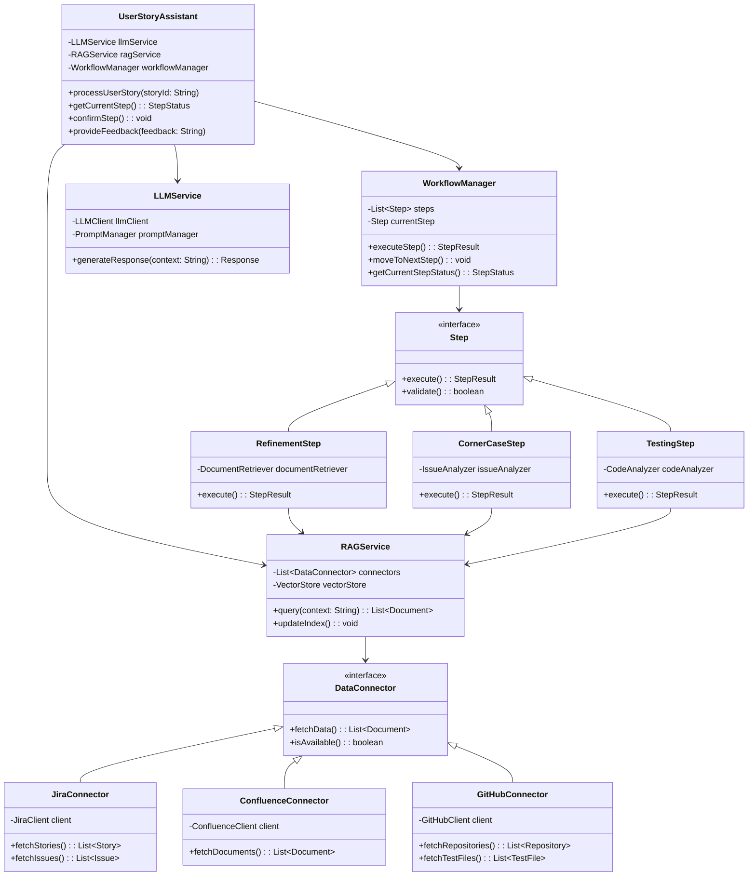
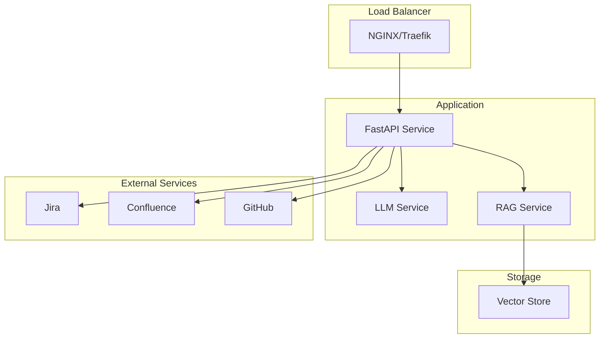
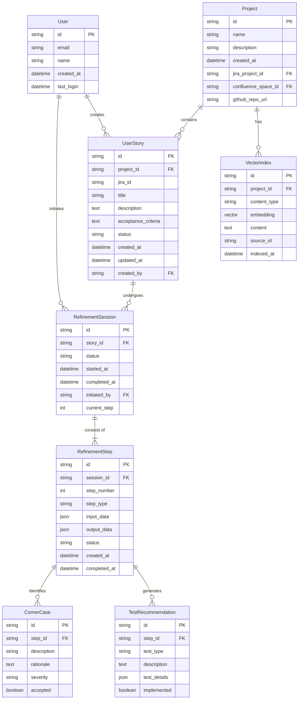
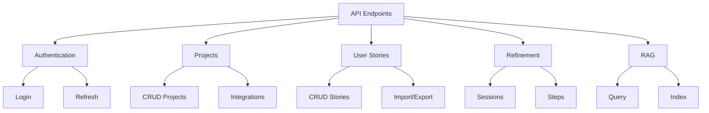

## Índice

0. [Ficha del proyecto](#0-ficha-del-proyecto)
1. [Descripción general del producto](#1-descripción-general-del-producto)
2. [Arquitectura del sistema](#2-arquitectura-del-sistema)
3. [Modelo de datos](#3-modelo-de-datos)
4. [Especificación de la API](#4-especificación-de-la-api)
5. [Historias de usuario](#5-historias-de-usuario)
6. [Tickets de trabajo](#6-tickets-de-trabajo)
7. [Pull requests](#7-pull-requests)

---

## 0. Ficha del proyecto

### **0.1. Tu nombre completo:**

Raúl García de Marina Maroto

### **0.2. Nombre del proyecto:**

Refinador de Historias de Usuario

### **0.3. Descripción breve del proyecto:**

Un asistente que usará un LLM y un sistema RAG para ayudar con el proceso de refinamiento de historias de usuario de un equipo de desarrollo.

### **0.4. URL del proyecto:**


https://github.com/rgarciademarina/AI4Devs-finalproject-RGM

---

## 1. Descripción general del producto

> Describe en detalle los siguientes aspectos del producto:

El Asistente de Refinamiento de Historias de Usuario es una herramienta basada en IA que ayuda a los equipos de desarrollo a mejorar la calidad de sus historias de usuario a través de un proceso guiado de tres pasos. Utiliza tecnología LLM (Large Language Model) combinada con un sistema RAG (Retrieval-Augmented Generation) para proporcionar recomendaciones contextualizadas basadas en el histórico del proyecto.

### **1.1. Objetivo:**

> Propósito del producto. Qué valor aporta, qué soluciona, y para quién.

Ayudar a los equipos de desarrollo a mejorar la calidad de sus historias de usuario a través de un proceso guiado de tres pasos.

Al tener acceso a la documentación del proyecto, a los tests ya existentes y a la historia de usuario, el asistente puede proporcionar recomendaciones para mejorar la historia de usuario, tanto en su redacción como en su posterior testing.

### **1.2. Características y funcionalidades principales:**

> Enumera y describe las características y funcionalidades específicas que tiene el producto para satisfacer las necesidades identificadas.

- Proceso guiado de tres pasos para el refinamiento de historias de usuario.
- Acceso a la documentación del proyecto, a los tests ya existentes y a la historia de usuario.
- Recomendaciones para mejorar la historia de usuario, tanto en su redacción como en su posterior testing.  

### **1.3. Diseño y experiencia de usuario:**

> Proporciona imágenes y/o videotutorial mostrando la experiencia del usuario desde que aterriza en la aplicación, pasando por todas las funcionalidades principales.

TBD

### **1.4. Instrucciones de instalación:**
> Documenta de manera precisa las instrucciones para instalar y poner en marcha el proyecto en local (librerías, backend, frontend, servidor, base de datos, migraciones y semillas de datos, etc.)

TBD

## 2. Arquitectura del Sistema

### **2.1. Diagrama de arquitectura:**
> Usa el formato que consideres más adecuado para representar los componentes principales de la aplicación y las tecnologías utilizadas. Explica si sigue algún patrón predefinido, justifica por qué se ha elegido esta arquitectura, y destaca los beneficios principales que aportan al proyecto y justifican su uso, así como sacrificios o déficits que implica.



### **2.2. Descripción de componentes principales:**

> Describe los componentes más importantes, incluyendo la tecnología utilizada

#### LLM Service
- **Tecnología principal**: OpenAI API / Anthropic Claude
- **Framework**: LangChain
- **Propósito**: Gestionar la interacción con el modelo de lenguaje para el análisis y generación de sugerencias
- **Características clave**:
  - Gestión de prompts
  - Control de contexto
  - Manejo de tokens
  - Procesamiento de respuestas

#### RAG Service
- **Tecnología principal**: ChromaDB
- **Framework**: LangChain
- **Propósito**: Gestionar el sistema de recuperación y generación de información contextual
- **Características clave**:
  - Indexación de documentos
  - Búsqueda semántica
  - Gestión de embeddings
  - Integración con fuentes de datos

#### API Service
- **Framework**: FastAPI
- **Base de datos**: PostgreSQL
- **Propósito**: Proporcionar la interfaz REST para la aplicación
- **Características clave**:
  - Autenticación y autorización
  - Validación de datos
  - Documentación automática
  - Gestión de sesiones

#### Conectores
- **Jira**: Biblioteca `atlassian-python-api`
- **Confluence**: Biblioteca `atlassian-python-api`
- **GitHub**: Biblioteca `PyGithub`
- **Propósito**: Integración con sistemas externos
- **Características clave**:
  - Gestión de credenciales
  - Caché de datos
  - Manejo de rate limits
  - Sincronización periódica

#### Frontend (Básico para MVP)
- **Framework**: Next.js
- **UI Library**: Tailwind CSS
- **Propósito**: Interfaz de usuario para interacción con el sistema
- **Características clave**:
  - Autenticación de usuarios
  - Formularios de entrada
  - Visualización de resultados
  - Feedback en tiempo real

### **2.3. Descripción de alto nivel del proyecto y estructura de ficheros**

> Representa la estructura del proyecto y explica brevemente el propósito de las carpetas principales, así como si obedece a algún patrón o arquitectura específica.

El proyecto sigue una arquitectura hexagonal (también conocida como puertos y adaptadores) para mantener el dominio de negocio aislado de las dependencias externas. La estructura de ficheros refleja esta separación de responsabilidades:

```
story-refinement-assistant/
├── .env.example                  # Template para variables de entorno
├── .gitignore
├── Dockerfile
├── README.md
├── docker-compose.yml
├── pyproject.toml               # Configuración de Poetry
├── docs/
│   ├── api/                    # Documentación de la API
│   ├── guides/                 # Guías de usuario
│   └── technical/             # Documentación técnica
├── scripts/
│   ├── setup.sh               # Scripts de configuración
│   └── test.sh               # Scripts de testing
├── src/
│   ├── __init__.py
│   ├── main.py               # Punto de entrada de FastAPI
│   ├── config/
│   │   ├── __init__.py
│   │   └── settings.py      # Configuración de la aplicación
│   ├── api/
│   │   ├── __init__.py
│   │   ├── routes/
│   │   │   ├── __init__.py
│   │   │   ├── story.py    # Endpoints de historias
│   │   │   └── workflow.py # Endpoints de workflow
│   │   └── dependencies.py
│   ├── core/
│   │   ├── __init__.py
│   │   ├── workflow/
│   │   │   ├── __init__.py
│   │   │   ├── manager.py
│   │   │   └── steps/
│   │   │       ├── __init__.py
│   │   │       ├── refinement.py
│   │   │       ├── corner_case.py
│   │   │       └── testing.py
│   │   └── assistant.py
│   ├── llm/
│   │   ├── __init__.py
│   │   ├── service.py      # Servicio LLM principal
│   │   └── prompts/       # Templates de prompts
│   │       ├── __init__.py
│   │       ├── refinement.py
│   │       ├── corner_case.py
│   │       └── testing.py
│   ├── rag/
│   │   ├── __init__.py
│   │   ├── service.py     # Servicio RAG principal
│   │   └── indexing.py    # Gestión de índices
│   ├── integrations/
│   │   ├── __init__.py
│   │   ├── jira/
│   │   │   ├── __init__.py
│   │   │   └── client.py
│   │   ├── confluence/
│   │   │   ├── __init__.py
│   │   │   └── client.py
│   │   └── github/
│   │       ├── __init__.py
│   │       └── client.py
│   ├── models/
│   │   ├── __init__.py
│   │   ├── story.py      # Modelos de datos
│   │   └── workflow.py
│   └── utils/
│       ├── __init__.py
│       ├── logging.py
│       └── helpers.py
├── tests/
│   ├── __init__.py
│   ├── conftest.py       # Configuración de pytest
│   ├── unit/
│   │   ├── __init__.py
│   │   ├── test_workflow.py
│   │   └── test_rag.py
│   └── integration/
│       ├── __init__.py
│       └── test_api.py
└── data/
    └── vector_store/     # Almacenamiento de índices
```

#### Descripción de Carpetas Principales:

- **src/**: Contiene todo el código fuente del proyecto
  - **api/**: Implementación de la API REST (adaptador primario)
  - **core/**: Lógica de negocio y reglas de dominio
  - **llm/**: Servicios de integración con modelos de lenguaje
  - **rag/**: Implementación del sistema de recuperación aumentada
  - **integrations/**: Adaptadores para sistemas externos
  - **models/**: Definición de modelos de datos
  - **utils/**: Utilidades compartidas

- **tests/**: Tests organizados por tipo
  - **unit/**: Tests unitarios de componentes individuales
  - **integration/**: Tests de integración entre componentes
  - **e2e/**: Tests end-to-end de flujos completos

- **docs/**: Documentación completa del proyecto
  - **api/**: Documentación de la API REST
  - **guides/**: Guías de usuario y desarrollo
  - **technical/**: Documentación técnica detallada

#### Patrones y Principios:

1. **Arquitectura Hexagonal**: Separa el dominio de la infraestructura
2. **Dependency Injection**: Facilita el testing y la modularidad
3. **Repository Pattern**: Abstrae el acceso a datos
4. **Factory Pattern**: Creación de objetos complejos
5. **Strategy Pattern**: Implementación de diferentes estrategias de procesamiento

### **2.4. Infraestructura y despliegue**

> Detalla la infraestructura del proyecto, incluyendo un diagrama en el formato que creas conveniente, y explica el proceso de despliegue que se sigue

### **2.4.1. Diagrama de Infraestructura**



#### Fases del Despliegue

1. **Fase de Construcción**
   - Validación de código y tests unitarios
   - Construcción de imágenes Docker
   - Push al registro de contenedores
   ```bash
   # Construcción de imágenes
   docker-compose build
   
   # Tests unitarios
   docker-compose run --rm api pytest tests/unit
   ```

2. **Fase de Staging**
   - Despliegue automático en entorno de staging
   - Ejecución de tests de integración
   - Validación de integraciones externas
   ```bash
   # Despliegue en staging
   docker-compose -f docker-compose.staging.yml up -d
   
   # Tests de integración
   docker-compose run --rm api pytest tests/integration
   ```

3. **Fase de Producción**
   - Despliegue gradual (rolling update)
   - Verificación de salud de servicios
   - Monitorización de métricas
   ```bash
   # Despliegue en producción
   docker stack deploy -c docker-compose.prod.yml story-refiner
   
   # Verificación de despliegue
   docker stack ps story-refiner
   ```

#### Configuración por Entorno

| Variable | Desarrollo | Staging | Producción |
|----------|------------|---------|------------|
| `ENVIRONMENT` | development | staging | production |
| `LOG_LEVEL` | DEBUG | INFO | WARNING |
| `DB_POOL_SIZE` | 5 | 10 | 20 |
| `CACHE_TTL` | 300 | 600 | 1800 |

#### Monitorización del Despliegue

- **Métricas Clave**
  - Tiempo de respuesta de API
  - Uso de recursos (CPU/Memoria)
  - Tasa de errores
  - Latencia de servicios externos

- **Alertas Configuradas**
  - Errores en despliegue
  - Fallos en health checks
  - Degradación de performance
  - Errores de integración

#### Rollback

En caso de detectar problemas durante el despliegue:

1. **Activación Automática**
   - Umbral de errores superado
   - Fallos en health checks
   - Timeouts excesivos

2. **Proceso de Rollback**
   ```bash
   # Revertir a versión anterior
   docker stack rollback story-refiner
   
   # Verificar estado
   docker stack ps story-refiner
   ```

#### Consideraciones de Seguridad

- Rotación automática de secretos
- Escaneo de vulnerabilidades en contenedores
- Validación de firmas de imágenes
- Logs de auditoría de despliegues

### **2.5. Seguridad**

> Enumera y describe las prácticas de seguridad principales que se han implementado en el proyecto, añadiendo ejemplos si procede

La seguridad del sistema se ha diseñado siguiendo el principio de defensa en profundidad, implementando múltiples capas de protección:

#### 2.5.1. Autenticación y Autorización

- **OAuth 2.0 / OpenID Connect**
  - Integración con Google OAuth para autenticación de usuarios
  - JWT para gestión de sesiones
  - Refresh tokens con rotación
  - Revocación inmediata de tokens comprometidos

- **Control de Acceso**
  - RBAC (Role-Based Access Control)
  - Permisos granulares por recurso
  - Validación de permisos en cada request
  ```python
  @requires_permission("stories:write")
  async def update_story(story_id: str, data: StoryUpdate):
      # Lógica de actualización
  ```

#### 2.5.2. Protección de Datos

- **Datos en Reposo**
  - Encriptación de datos sensibles en base de datos
  - Hashing de credenciales con algoritmos seguros (Argon2)
  - Backups encriptados

- **Datos en Tránsito**
  - TLS 1.3 obligatorio
  - HSTS habilitado
  - Certificados automáticamente renovados con Let's Encrypt

- **Secretos**
  - Gestión con HashiCorp Vault
  - Rotación automática de credenciales
  - Acceso auditado a secretos

#### 2.5.3. Protección de API

- **Rate Limiting**
  - Límites por usuario/IP
  - Cooldown en endpoints intensivos
  - Protección contra DDoS

- **Validación de Entrada**
  - Sanitización de inputs
  - Validación de esquemas con Pydantic
  - Prevención de inyección SQL con SQLAlchemy

- **Headers de Seguridad**
  ```python
  security_headers = {
      'X-Frame-Options': 'DENY',
      'X-Content-Type-Options': 'nosniff',
      'X-XSS-Protection': '1; mode=block',
      'Content-Security-Policy': "default-src 'self'",
  }
  ```

#### 2.5.4. Monitorización y Auditoría

- **Logging**
  - Logs centralizados con ELK Stack
  - Alertas en tiempo real
  - Retención de logs según normativa

- **Auditoría**
  - Registro de todas las operaciones sensibles
  - Trazabilidad completa de cambios
  - Reportes periódicos de actividad

#### 2.5.5. Seguridad en Integraciones

- **Conexiones Externas**
  - Tokens de acceso con mínimos privilegios
  - Renovación automática de credenciales
  - Timeouts y circuit breakers

- **Almacenamiento de Credenciales**
  - Encriptación de credenciales de servicios externos
  - Acceso restringido a tokens
  - Rotación periódica de claves

#### 2.5.6. CI/CD Security

- **Pipeline**
  - Escaneo de dependencias con Safety
  - Análisis estático con Bandit
  - Verificación de secretos con detect-secrets

- **Contenedores**
  - Escaneo de vulnerabilidades con Trivy
  - Imágenes base mínimas
  - Principio de mínimo privilegio

#### 2.5.7. Respuesta a Incidentes

- **Plan de Respuesta**
  - Procedimientos documentados
  - Equipo de respuesta definido
  - Canales de comunicación establecidos

- **Recuperación**
  - Backups regulares
  - Procedimientos de restauración probados
  - Plan de continuidad documentado

### **2.6. Tests**

> Describe brevemente algunos de los tests realizados

TBD

## 3. Modelo de Datos

### **3.1. Diagrama del modelo de datos:**

> Recomendamos usar mermaid para el modelo de datos, y utilizar todos los parámetros que permite la sintaxis para dar el máximo detalle, por ejemplo las claves primarias y foráneas.



### **3.2. Descripción de entidades principales:**

> Recuerda incluir el máximo detalle de cada entidad, como el nombre y tipo de cada atributo, descripción breve si procede, claves primarias y foráneas, relaciones y tipo de relación, restricciones (unique, not null…), etc.

#### 1. User
Representa a los usuarios del sistema.
- `id`: Identificador único UUID
- `email`: Email corporativo del usuario
- `name`: Nombre completo
- `created_at`: Fecha de creación
- `last_login`: Último acceso

#### 2. Project
Configura un proyecto y sus integraciones.
- `id`: Identificador único UUID
- `name`: Nombre del proyecto
- `description`: Descripción del proyecto
- `jira_project_id`: ID del proyecto en Jira
- `confluence_space_id`: ID del espacio en Confluence
- `github_repo_url`: URL del repositorio en GitHub

#### 3. UserStory
Historia de usuario a refinar.
- `id`: Identificador único UUID
- `project_id`: Referencia al proyecto
- `jira_id`: ID en Jira
- `title`: Título de la historia
- `description`: Descripción en formato markdown
- `acceptance_criteria`: Criterios en formato markdown
- `status`: Estado actual (draft, refining, completed)
- `created_by`: Usuario que creó la historia

#### 4. RefinementSession
Sesión de refinamiento de una historia.
- `id`: Identificador único UUID
- `story_id`: Historia siendo refinada
- `status`: Estado de la sesión
- `started_at`: Inicio de la sesión
- `completed_at`: Finalización de la sesión
- `current_step`: Paso actual del proceso

#### 5. RefinementStep
Paso individual en el proceso de refinamiento.
- `id`: Identificador único UUID
- `session_id`: Sesión a la que pertenece
- `step_number`: Número de paso (1-3)
- `step_type`: Tipo de paso (refinement, corner_case, testing)
- `input_data`: Datos de entrada en JSON
- `output_data`: Resultados en JSON
- `status`: Estado del paso

#### 6. CornerCase
Caso esquina identificado durante el refinamiento.
- `id`: Identificador único UUID
- `step_id`: Paso que lo identificó
- `description`: Descripción del caso
- `rationale`: Justificación
- `severity`: Severidad (high, medium, low)
- `accepted`: Si fue aceptado por el usuario

#### 7. TestRecommendation
Recomendación de test generada.
- `id`: Identificador único UUID
- `step_id`: Paso que lo generó
- `test_type`: Tipo de test (unit, integration, e2e)
- `description`: Descripción del test
- `test_details`: Detalles técnicos en JSON
- `implemented`: Si fue implementado

#### 8. VectorIndex
Índices vectoriales para el sistema RAG.
- `id`: Identificador único UUID
- `project_id`: Proyecto al que pertenece
- `content_type`: Tipo de contenido indexado
- `embedding`: Vector de embeddings
- `content`: Contenido original
- `source_id`: ID del documento fuente

## 4. Especificación de la API

> Si tu backend se comunica a través de API, describe los endpoints principales (máximo 3) en formato OpenAPI. Opcionalmente puedes añadir un ejemplo de petición y de respuesta para mayor claridad

### **4.1. Estructura General**



### **4.2. Endpoints**

#### 1. Autenticación
```yaml
/auth:
  /login:
    post:
      summary: Iniciar sesión con Google OAuth
      responses:
        200:
          description: Login exitoso
          content:
            application/json:
              schema:
                type: object
                properties:
                  access_token: string
                  refresh_token: string
  
  /refresh:
    post:
      summary: Renovar token de acceso
      security:
        - BearerAuth: []
      responses:
        200:
          description: Token renovado
```

#### 2. Proyectos
```yaml
/projects:
  get:
    summary: Listar proyectos
    security:
      - BearerAuth: []
    responses:
      200:
        description: Lista de proyectos
        content:
          application/json:
            schema:
              type: array
              items:
                $ref: '#/components/schemas/Project'

  post:
    summary: Crear proyecto
    security:
      - BearerAuth: []
    requestBody:
      required: true
      content:
        application/json:
          schema:
            $ref: '#/components/schemas/ProjectCreate'
    responses:
      201:
        description: Proyecto creado

  /{project_id}:
    get:
      summary: Obtener proyecto
    put:
      summary: Actualizar proyecto
    delete:
      summary: Eliminar proyecto
```

#### 3. Historias de Usuario
```yaml
/stories:
  get:
    summary: Listar historias
    parameters:
      - name: project_id
        in: query
        required: false
        schema:
          type: string
      - name: status
        in: query
        required: false
        schema:
          type: string
    responses:
      200:
        description: Lista de historias

  post:
    summary: Crear historia
    requestBody:
      required: true
      content:
        application/json:
          schema:
            $ref: '#/components/schemas/UserStoryCreate'

  /{story_id}:
    get:
      summary: Obtener historia
    put:
      summary: Actualizar historia
    delete:
      summary: Eliminar historia
```

#### 4. Refinamiento
```yaml
/refinement:
  /sessions:
    post:
      summary: Iniciar sesión de refinamiento
      requestBody:
        required: true
        content:
          application/json:
            schema:
              type: object
              properties:
                story_id: string
      responses:
        201:
          description: Sesión iniciada
          content:
            application/json:
              schema:
                $ref: '#/components/schemas/RefinementSession'

  /sessions/{session_id}/steps:
    post:
      summary: Ejecutar siguiente paso
      responses:
        200:
          description: Resultado del paso
          content:
            application/json:
              schema:
                $ref: '#/components/schemas/StepResult'
```

#### 5. RAG
```yaml
/rag:
  /query:
    post:
      summary: Consultar sistema RAG
      requestBody:
        required: true
        content:
          application/json:
            schema:
              type: object
              properties:
                query: string
                project_id: string
      responses:
        200:
          description: Resultados de la consulta

  /index:
    post:
      summary: Indexar nuevo contenido
      requestBody:
        required: true
        content:
          application/json:
            schema:
              type: object
              properties:
                content: string
                content_type: string
                project_id: string
```

## 5. Historias de Usuario

> Documenta 3 de las historias de usuario principales utilizadas durante el desarrollo, teniendo en cuenta las buenas prácticas de producto al respecto.

### **5.1. Autenticación y Gestión de Usuarios**

```gherkin
Historia US-001: Login con Google
Como usuario del sistema
Quiero poder autenticarme usando mi cuenta de Google
Para acceder de forma segura al sistema

Criterios de Aceptación:
- Debe mostrar el botón de "Login con Google"
- Debe redirigir a la pantalla de selección de cuenta de Google
- Debe validar que el email pertenece al dominio corporativo
- Debe redirigir al dashboard tras login exitoso
- Debe mostrar mensaje de error si falla la autenticación
```

### **5.2. Gestión de Proyectos**

```gherkin
Historia US-002: Crear Proyecto
Como líder técnico
Quiero poder crear un nuevo proyecto
Para comenzar a gestionar sus historias de usuario

Criterios de Aceptación:
- Debe permitir ingresar nombre y descripción
- Debe permitir configurar integración con Jira
- Debe permitir configurar integración con Confluence
- Debe permitir configurar integración con GitHub
- Debe validar las credenciales de integración
```

```gherkin
Historia US-003: Configurar Integraciones
Como líder técnico
Quiero poder configurar las integraciones del proyecto
Para conectar con las herramientas existentes

Criterios de Aceptación:
- Debe permitir configurar tokens de acceso
- Debe validar la conexión con cada servicio
- Debe mostrar estado de la conexión
- Debe permitir actualizar credenciales
```

### **5.3. Gestión de Historias**

```gherkin
Historia US-004: Importar Historia desde Jira
Como analista
Quiero poder importar una historia desde Jira
Para comenzar su proceso de refinamiento

Criterios de Aceptación:
- Debe permitir buscar por ID de Jira
- Debe importar título, descripción y criterios
- Debe mantener referencia al ID de Jira
- Debe notificar si la historia ya existe
```

```gherkin
Historia US-005: Crear Historia Manual
Como analista
Quiero poder crear una historia manualmente
Para refinar historias que aún no están en Jira

Criterios de Aceptación:
- Debe permitir ingresar título
- Debe permitir ingresar descripción en markdown
- Debe permitir ingresar criterios de aceptación
- Debe validar campos obligatorios
```

### **5.4. Proceso de Refinamiento**

```gherkin
Historia US-006: Iniciar Refinamiento
Como analista
Quiero poder iniciar el proceso de refinamiento de una historia
Para mejorar su calidad

Criterios de Aceptación:
- Debe mostrar el estado actual de la historia
- Debe iniciar el primer paso de refinamiento
- Debe mostrar el progreso del proceso
- Debe permitir pausar el proceso
```

```gherkin
Historia US-007: Ejecutar Paso de Refinamiento
Como analista
Quiero poder ejecutar cada paso del refinamiento
Para obtener sugerencias de mejora

Criterios de Aceptación:
- Debe mostrar sugerencias del LLM
- Debe permitir aceptar/rechazar sugerencias
- Debe permitir añadir comentarios
- Debe guardar el historial de cambios
```

```gherkin
Historia US-008: Revisar Casos Esquina
Como analista
Quiero poder revisar los casos esquina identificados
Para asegurar la completitud de la historia

Criterios de Aceptación:
- Debe listar casos esquina identificados
- Debe mostrar justificación de cada caso
- Debe permitir aceptar/rechazar casos
- Debe permitir añadir casos manualmente
```

### **5.5. Testing**

```gherkin
Historia US-009: Generar Recomendaciones de Testing
Como QA
Quiero recibir recomendaciones de testing
Para asegurar la calidad de la historia

Criterios de Aceptación:
- Debe generar casos de prueba sugeridos
- Debe categorizar por tipo de test
- Debe permitir exportar a formato de test
- Debe mantener trazabilidad con la historia
```

### **5.6. Integración y Exportación**

```gherkin
Historia US-010: Actualizar Historia en Jira
Como analista
Quiero poder actualizar la historia en Jira
Para mantener sincronización con el sistema principal

Criterios de Aceptación:
- Debe actualizar descripción en Jira
- Debe actualizar criterios de aceptación
- Debe añadir casos esquina como subtareas
- Debe mantener formato markdown
```

### **5.7. Priorización para MVP**

Prioridad 1 (Esencial):
- US-001: Login con Google
- US-002: Crear Proyecto
- US-004: Importar Historia desde Jira
- US-006: Iniciar Refinamiento
- US-007: Ejecutar Paso de Refinamiento

Prioridad 2 (Importante):
- US-003: Configurar Integraciones
- US-008: Revisar Casos Esquina
- US-010: Actualizar Historia en Jira

Prioridad 3 (Deseable):
- US-005: Crear Historia Manual
- US-009: Generar Recomendaciones de Testing

### **5.8. Ejemplo de Criterios de Aceptación Detallados**

Para US-007: Ejecutar Paso de Refinamiento

```gherkin
Escenario: Ejecutar paso de refinamiento exitoso
Dado que tengo una historia en proceso de refinamiento
Y estoy en el paso de "análisis de completitud"
Cuando solicito ejecutar el paso
Entonces el sistema debe:
  - Analizar la historia actual
  - Generar sugerencias de mejora
  - Mostrar justificación para cada sugerencia
  - Permitir seleccionar sugerencias a aplicar
  - Guardar las sugerencias aceptadas
  - Actualizar el contenido de la historia
  - Marcar el paso como completado

Escenario: Sugerencias rechazadas
Dado que recibo sugerencias de mejora
Cuando rechazo una sugerencia
Entonces el sistema debe:
  - Solicitar motivo del rechazo
  - Guardar el feedback para mejora del modelo
  - No aplicar los cambios sugeridos
  - Permitir continuar con el proceso

Escenario: Error en el proceso
Dado que estoy ejecutando un paso
Cuando ocurre un error en el procesamiento
Entonces el sistema debe:
  - Mostrar mensaje de error claro
  - Guardar el progreso actual
  - Permitir reintentar la operación
  - Ofrecer modo manual como alternativa
```

¿Te gustaría que profundizáramos en alguna historia específica o que añadiéramos más escenarios de prueba?

---

## 6. Tickets de Trabajo

> Documenta 3 de los tickets de trabajo principales del desarrollo, uno de backend, uno de frontend, y uno de bases de datos. Da todo el detalle requerido para desarrollar la tarea de inicio a fin teniendo en cuenta las buenas prácticas al respecto. 

### **6.1. Infraestructura y Setup**

#### TECH-001: Setup Inicial del Proyecto
**Tipo:** Tarea Técnica  
**Prioridad:** Alta  
**Estimación:** 5 puntos  
**Dependencias:** Ninguna

**Descripción:**
- Crear repositorio en GitHub
- Configurar estructura base del proyecto
- Setup de FastAPI y dependencias
- Configurar Docker y docker-compose
- Setup de pre-commit hooks
- Configurar linting y formateo

**Criterios de Aceptación:**
- Repositorio creado y accesible
- Proyecto ejecutable localmente
- Tests básicos funcionando
- CI/CD inicial configurado

#### TECH-002: Configuración de Base de Datos
**Tipo:** Tarea Técnica  
**Prioridad:** Alta  
**Estimación:** 3 puntos  
**Dependencias:** TECH-001

**Descripción:**
- Setup de PostgreSQL
- Configurar SQLAlchemy
- Crear modelos base
- Configurar migraciones con Alembic
- Implementar seeders básicos

**Criterios de Aceptación:**
- Base de datos funcionando en Docker
- Migraciones ejecutándose correctamente
- Modelos base creados y testeados

### **6.2. Autenticación**

#### TECH-003: Implementación OAuth Google
**Tipo:** Tarea Técnica  
**Prioridad:** Alta  
**Estimación:** 5 puntos  
**Dependencias:** TECH-001

**Descripción:**
- Configurar Google OAuth
- Implementar endpoints de autenticación
- Crear middleware de autenticación
- Implementar manejo de JWT
- Configurar refresh tokens

**Criterios de Aceptación:**
- Login con Google funcionando
- Tokens JWT generados correctamente
- Refresh token implementado
- Tests de autenticación pasando

### **6.3. Integración con Servicios Externos**

#### TECH-004: Cliente Jira
**Tipo:** Tarea Técnica  
**Prioridad:** Alta  
**Estimación:** 5 puntos  
**Dependencias:** TECH-001, TECH-003

**Descripción:**
- Implementar cliente Jira
- Crear métodos para CRUD de issues
- Implementar sincronización de estados
- Manejar autenticación con Jira
- Implementar caché de requests

**Criterios de Aceptación:**
- Cliente Jira funcionando
- Operaciones CRUD testeadas
- Manejo de errores implementado
- Caché funcionando correctamente

#### TECH-005: Cliente Confluence
**Tipo:** Tarea Técnica  
**Prioridad:** Media  
**Estimación:** 3 puntos  
**Dependencias:** TECH-001, TECH-003

**Descripción:**
- Implementar cliente Confluence
- Crear métodos para lectura de páginas
- Implementar búsqueda en espacios
- Configurar autenticación

### **6.4. Sistema RAG**

#### TECH-006: Setup Vector Store
**Tipo:** Tarea Técnica  
**Prioridad:** Alta  
**Estimación:** 8 puntos  
**Dependencias:** TECH-002

**Descripción:**
- Configurar ChromaDB
- Implementar gestión de embeddings
- Crear índices y colecciones
- Implementar búsqueda por similitud
- Configurar persistencia

**Criterios de Aceptación:**
- Vector store funcionando
- Búsquedas realizándose correctamente
- Persistencia funcionando
- Tests de rendimiento pasando

#### TECH-007: Integración LLM
**Tipo:** Tarea Técnica  
**Prioridad:** Alta  
**Estimación:** 8 puntos  
**Dependencias:** TECH-006

**Descripción:**
- Configurar cliente de LLM
- Implementar prompt templates
- Crear pipeline de procesamiento
- Implementar cache de respuestas
- Configurar fallbacks

**Criterios de Aceptación:**
- LLM respondiendo correctamente
- Prompts funcionando según esperado
- Cache implementado
- Tests de integración pasando

### **6.5. API Core**

#### TECH-008: Endpoints de Proyectos
**Tipo:** Tarea Técnica  
**Prioridad:** Alta  
**Estimación:** 3 puntos  
**Dependencias:** TECH-002, TECH-003

**Descripción:**
- Implementar CRUD de proyectos
- Crear validaciones
- Implementar filtros y búsqueda
- Añadir paginación

#### TECH-009: Endpoints de Historias
**Tipo:** Tarea Técnica  
**Prioridad:** Alta  
**Estimación:** 5 puntos  
**Dependencias:** TECH-004, TECH-008

**Descripción:**
- Implementar CRUD de historias
- Crear sincronización con Jira
- Implementar validaciones
- Añadir búsqueda y filtros

### **6.6. Proceso de Refinamiento**

#### TECH-010: Motor de Refinamiento
**Tipo:** Tarea Técnica  
**Prioridad:** Alta  
**Estimación:** 13 puntos  
**Dependencias:** TECH-007, TECH-009

**Descripción:**
- Implementar máquina de estados
- Crear pipeline de procesamiento
- Implementar análisis de completitud
- Crear detector de casos esquina
- Implementar generador de tests

**Criterios de Aceptación:**
- Pipeline completo funcionando
- Casos esquina detectados correctamente
- Sugerencias de test generadas
- Tests de integración pasando

### **6.7. Frontend (Básico para MVP)**

#### TECH-011: Setup Frontend
**Tipo:** Tarea Técnica  
**Prioridad:** Media  
**Estimación:** 5 puntos  
**Dependencias:** TECH-003

**Descripción:**
- Configurar Next.js
- Implementar autenticación
- Crear layouts base
- Configurar routing
- Implementar estado global

#### TECH-012: Componentes Core
**Tipo:** Tarea Técnica  
**Prioridad:** Media  
**Estimación:** 8 puntos  
**Dependencias:** TECH-011

**Descripción:**
- Crear componentes base
- Implementar formularios
- Crear vistas principales
- Implementar navegación
- Añadir feedback visual

### **6.8. Testing y QA**

#### TECH-013: Suite de Tests
**Tipo:** Tarea Técnica  
**Prioridad:** Alta  
**Estimación:** 5 puntos  
**Dependencias:** Todos los anteriores

**Descripción:**
- Configurar pytest
- Crear fixtures comunes
- Implementar mocks necesarios
- Crear tests de integración
- Configurar coverage

**Criterios de Aceptación:**
- Cobertura > 80%
- Tests de integración pasando
- Mocks funcionando correctamente
- CI ejecutando tests

¿Te gustaría que profundizáramos en algún ticket específico o que añadiéramos más detalles a alguna sección?

Estos tickets técnicos cubren las necesidades de implementación del MVP, manteniendo un balance entre funcionalidad core y calidad técnica. Cada ticket está enfocado en una parte específica del sistema y tiene dependencias y criterios de aceptación claros.

---

## 7. Pull Requests

> Documenta 3 de las Pull Requests realizadas durante la ejecución del proyecto

TBD

**Pull Request 1**

**Pull Request 2**

**Pull Request 3**

